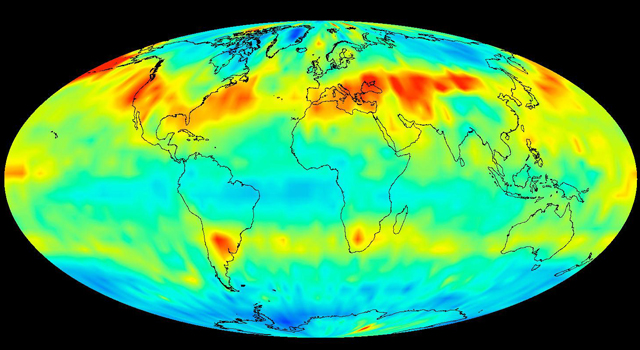
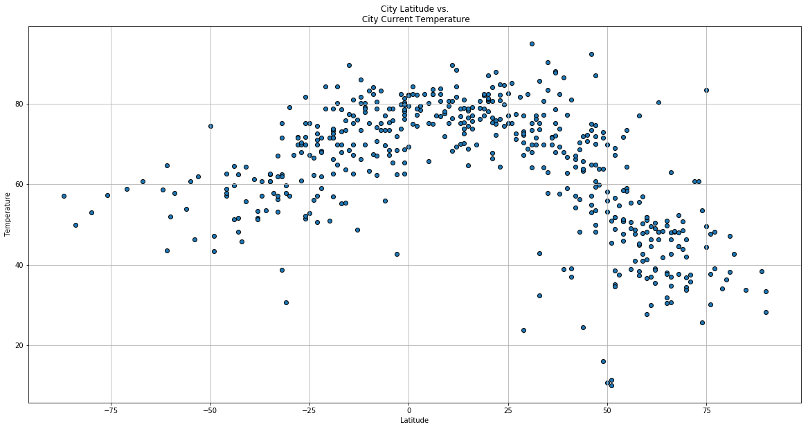
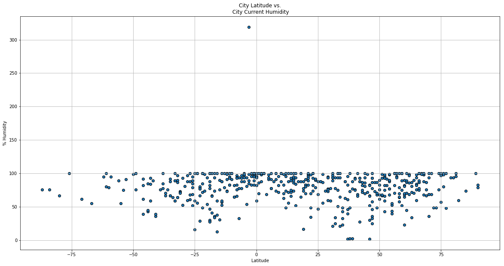
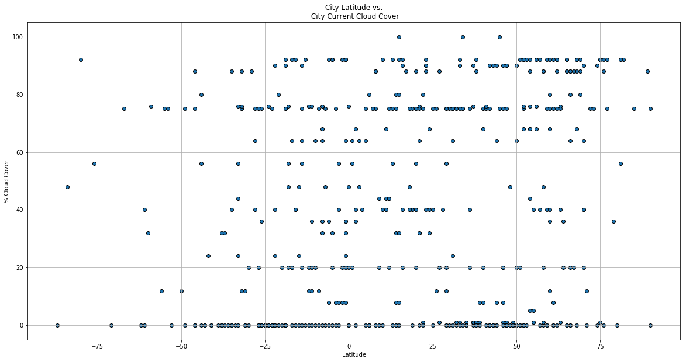
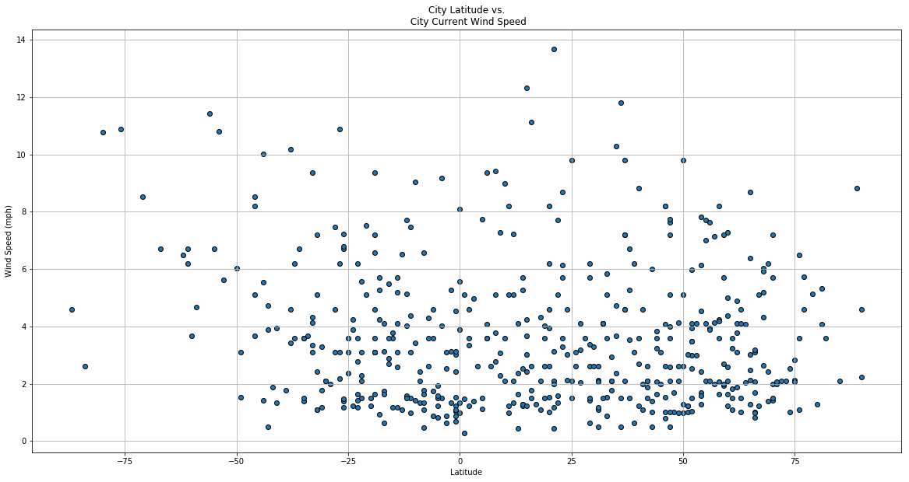

# Weather Modeling



You may know how the weather changes as you approach the equator, but how would you prove it if pressed? In the following demonstration, I'll be creating a Python script to visualize the weather of 500+ cities across the world, of varying distance from the equator. To accomplish this, I will utilize a simple Python library, the OpenWeatherMap API, and a little common sense to create a representative model of weather across world cities.

The objective will be to build a series of scatter plots to showcase the following relationships:
- Temperature (F) vs. Latitude
- Humidity (%) vs. Latitude
- Cloudiness (%) vs. Latitude
- Wind Speed (mph) vs. Latitude

For a refresher, here is a quick orientation to the [geographic coordinate system](http://google.com).

The OpenWeatherMap API exposes weather data from a network of over 40,000 weather stations worldwide. For getting started with the OpenWeatherMap API, visit their [getting started page](https://openweathermap.org/appid) to request a key.

For this analysis, I also used:
- An OpenWeatherMap API wrapper library called openweathermapy, which can be found [here](https://github.com/crazycapivara/openweathermapy).
- Citipy, a library that locates the nearest city to a given set of geocoordinates, citipy, which can be found [here](https://github.com/wingchen/citipy).

Install these two libraries with your favorite package manager to follow along!

## Methodology

1. Generate a sufficiently large sample of random geocoordinates.
2. Use these geocoordinates and citipy to generate a list of the closest cities to each geocoordinate.
3. Use the list of cities to generate a series of API calls to OpenWeatherMap (which only accepts city names), retrieving and storing:
    - Actual latitude and longitude of city
    - Current temperature, humidity, cloudiness, and wind speed.
4. Covert stored data to a PANDAS dataframe and plot weather measurements as a function of latitude.

### Import dependencies:


```python
import pandas as pd
import openweathermapy as ow
from citipy import citipy
import random
import requests
import json
import matplotlib.pyplot as plt
```

### Random latitude and longitude generation

First, lets create an array with 2000 latitudes and another with 2000 longitudes.
- Let's evenly space them out across the globe to get a wide range of locations.
- Note that:
  - Latitudes range from -90 to 90
  - Longitudes range from -180 to 180
  - Here we will take a list of 2000 numbers rather than 500.
      - This will help us avoid doubles of one city later in the script.
          - Each time we cross-reference through an api, there will be cities that there is no data for, therefore we need a surplus of input possibilities


```python
# create empty lists to hold random lat/longs
latitudes = []
longitudes = []

# populate the lists using the random library
for x in range(0, 2000):
    latitudes.append(random.randint(-90,90))
    longitudes.append(random.randint(-180,180))
```


```python
len(latitudes)
```


    2000


```python
len(longitudes)
```


    2000


### Translating latitudes and longitudes to city names

Now we have to feed these longitudes and latitudes into citipy to output a list of 500 cities (with no doubles):


```python
# create empty lists to hold city information
cities = []
countries = []
newlats = []
newlongs = []
counter = 0
incrementer = 0

while counter < 600:
    # extract geocoordinates from random list
    lat = latitudes[incrementer]
    lon = longitudes[incrementer]
    # look up nearest city and its country code
    city = citipy.nearest_city(lat, lon)
    name = city.city_name
    country = city.country_code
    # ensure the city is not already in list
    if name not in cities:
        # log progress
        print(len(cities))
        # add city, lat, long, country to respective lists
        cities.append(name)
        countries.append(country)
        newlats.append(lat)
        newlongs.append(lon)
        # increment counter and incrementer
        counter = counter + 1
        incrementer = incrementer + 1
    else:
        incrementer = incrementer + 1
    
```

    0
    1
    2
    3
    4
    5
    6
    7
    8
    9
    10
    11
    12
    13
    14
    15
    16
    17
    18
    19
    20
    21
    22
    23
    24
    25
    26
    27
    28
    29
    30
    31
    32
    33
    34
    35
    36
    37
    38
    39
    40
    41
    42
    43
    44
    45
    46
    47
    48
    49
    50
    51
    52
    53
    54
    55
    56
    57
    58
    59
    60
    61
    62
    63
    64
    65
    66
    67
    68
    69
    70
    71
    72
    73
    74
    75
    76
    77
    78
    79
    80
    81
    82
    83
    84
    85
    86
    87
    88
    89
    90
    91
    92
    93
    94
    95
    96
    97
    98
    99
    100
    101
    102
    103
    104
    105
    106
    107
    108
    109
    110
    111
    112
    113
    114
    115
    116
    117
    118
    119
    120
    121
    122
    123
    124
    125
    126
    127
    128
    129
    130
    131
    132
    133
    134
    135
    136
    137
    138
    139
    140
    141
    142
    143
    144
    145
    146
    147
    148
    149
    150
    151
    152
    153
    154
    155
    156
    157
    158
    159
    160
    161
    162
    163
    164
    165
    166
    167
    168
    169
    170
    171
    172
    173
    174
    175
    176
    177
    178
    179
    180
    181
    182
    183
    184
    185
    186
    187
    188
    189
    190
    191
    192
    193
    194
    195
    196
    197
    198
    199
    200
    201
    202
    203
    204
    205
    206
    207
    208
    209
    210
    211
    212
    213
    214
    215
    216
    217
    218
    219
    220
    221
    222
    223
    224
    225
    226
    227
    228
    229
    230
    231
    232
    233
    234
    235
    236
    237
    238
    239
    240
    241
    242
    243
    244
    245
    246
    247
    248
    249
    250
    251
    252
    253
    254
    255
    256
    257
    258
    259
    260
    261
    262
    263
    264
    265
    266
    267
    268
    269
    270
    271
    272
    273
    274
    275
    276
    277
    278
    279
    280
    281
    282
    283
    284
    285
    286
    287
    288
    289
    290
    291
    292
    293
    294
    295
    296
    297
    298
    299
    300
    301
    302
    303
    304
    305
    306
    307
    308
    309
    310
    311
    312
    313
    314
    315
    316
    317
    318
    319
    320
    321
    322
    323
    324
    325
    326
    327
    328
    329
    330
    331
    332
    333
    334
    335
    336
    337
    338
    339
    340
    341
    342
    343
    344
    345
    346
    347
    348
    349
    350
    351
    352
    353
    354
    355
    356
    357
    358
    359
    360
    361
    362
    363
    364
    365
    366
    367
    368
    369
    370
    371
    372
    373
    374
    375
    376
    377
    378
    379
    380
    381
    382
    383
    384
    385
    386
    387
    388
    389
    390
    391
    392
    393
    394
    395
    396
    397
    398
    399
    400
    401
    402
    403
    404
    405
    406
    407
    408
    409
    410
    411
    412
    413
    414
    415
    416
    417
    418
    419
    420
    421
    422
    423
    424
    425
    426
    427
    428
    429
    430
    431
    432
    433
    434
    435
    436
    437
    438
    439
    440
    441
    442
    443
    444
    445
    446
    447
    448
    449
    450
    451
    452
    453
    454
    455
    456
    457
    458
    459
    460
    461
    462
    463
    464
    465
    466
    467
    468
    469
    470
    471
    472
    473
    474
    475
    476
    477
    478
    479
    480
    481
    482
    483
    484
    485
    486
    487
    488
    489
    490
    491
    492
    493
    494
    495
    496
    497
    498
    499
    500
    501
    502
    503
    504
    505
    506
    507
    508
    509
    510
    511
    512
    513
    514
    515
    516
    517
    518
    519
    520
    521
    522
    523
    524
    525
    526
    527
    528
    529
    530
    531
    532
    533
    534
    535
    536
    537
    538
    539
    540
    541
    542
    543
    544
    545
    546
    547
    548
    549
    550
    551
    552
    553
    554
    555
    556
    557
    558
    559
    560
    561
    562
    563
    564
    565
    566
    567
    568
    569
    570
    571
    572
    573
    574
    575
    576
    577
    578
    579
    580
    581
    582
    583
    584
    585
    586
    587
    588
    589
    590
    591
    592
    593
    594
    595
    596
    597
    598
    599


Now lets check that the lists are of proper length, and that they contain sensical data


```python
len(cities)
```


    600


```python
cities[0]
```


    'berlevag'


```python
len(countries)  
```


    600


```python
countries[0]
```


    'no'


### Preparation and testing of OpenWeatherMap API call

Now lets prepare the keys and url for calls to OWM api, specifically the weather check API:


```python
api_key = '5ef1cc648f78446fbe0d9dd0d90e6060'
base_url = 'http://api.openweathermap.org/data/2.5/weather?'
# London,uk
url = base_url + '&APPID=' + api_key + '&q='
url
```


    'http://api.openweathermap.org/data/2.5/weather?&APPID=5ef1cc648f78446fbe0d9dd0d90e6060&q='


Now we can iterate over the list of cities and country codes to get our weather metrics:
- Temperature (F) 
  - ['main']['temp']
- Humidity (%)
  - ['main']['humidity']
- Cloudiness (%) 
  - ['clouds']['all']
- Wind Speed (mph)
  - ['wind']['speed']
  
Let's see how the json is laid out:


```python
# construct query URL and store response JSON
ajson = requests.get(url + 'london,uk').json()
```


```python
# pretty-print JSON
print(json.dumps(ajson, indent=4, sort_keys=True))
```

    {
        "base": "stations",
        "clouds": {
            "all": 0
        },
        "cod": 200,
        "coord": {
            "lat": 51.51,
            "lon": -0.13
        },
        "dt": 1536879000,
        "id": 2643743,
        "main": {
            "humidity": 62,
            "pressure": 1022,
            "temp": 285.28,
            "temp_max": 288.15,
            "temp_min": 283.15
        },
        "name": "London",
        "sys": {
            "country": "GB",
            "id": 5091,
            "message": 0.0055,
            "sunrise": 1536816812,
            "sunset": 1536862660,
            "type": 1
        },
        "visibility": 10000,
        "weather": [
            {
                "description": "clear sky",
                "icon": "01n",
                "id": 800,
                "main": "Clear"
            }
        ],
        "wind": {
            "deg": 230,
            "speed": 3.1
        }
    }


### Retrieval of current weather data

Now that we know the structure of the JSON, we can create a while loop to call the API and extract the relevant data for storage


```python
# create empty lists to store parts of JSON response
newcities = []
newerlats = []
newerlongs = []
newcountries = []
temperatures = []
humidities = []
clouds = []
windspeeds = []
counter = 0
incrementer = 0

# continue calling API until 500 successful calls
while counter < 500:
    # read city, country, lat, long from list
    city = cities[incrementer]
    country = countries[incrementer]
    latitude = newlats[incrementer]
    longitude = newlongs[incrementer]
    # coustruct query URL and call
    tempurl = url + city + ',' + country
    thejson = requests.get(tempurl).json()
    # log API call
    print('requesting data for: ' + city)
    print('at url: ' + tempurl)
    
    try:
        # retrieve data from response JSON
        # convert temp from kelvin to farenheit
        temp = ((float(thejson['main']['temp']) - 273.15) * (9/5)) + 32  
        hum = thejson['main']['humidity']
        cld = thejson['clouds']['all']
        wind = thejson['wind']['speed']
    
        # store response data in respective lists
        temperatures.append(temp)
        humidities.append(hum)
        clouds.append(cld)
        windspeeds.append(wind)
        
        # store query data
        newcities.append(city)
        newcountries.append(country)
        newerlats.append(latitude)
        newerlongs.append(longitude)

        print(city + ' successfully added as record #' + str(counter))
        
        counter = counter + 1
        incrementer = incrementer + 1
    
    except:
        print(city + ' not found in owm, moving on...')
        incrementer = incrementer + 1
```

    requesting data for: berlevag
    at url: http://api.openweathermap.org/data/2.5/weather?&APPID=5ef1cc648f78446fbe0d9dd0d90e6060&q=berlevag,no
    berlevag successfully added as record #0
    requesting data for: norman wells
    at url: http://api.openweathermap.org/data/2.5/weather?&APPID=5ef1cc648f78446fbe0d9dd0d90e6060&q=norman wells,ca
    norman wells successfully added as record #1
    requesting data for: rikitea
    at url: http://api.openweathermap.org/data/2.5/weather?&APPID=5ef1cc648f78446fbe0d9dd0d90e6060&q=rikitea,pf
    rikitea successfully added as record #2
    requesting data for: san cristobal
    at url: http://api.openweathermap.org/data/2.5/weather?&APPID=5ef1cc648f78446fbe0d9dd0d90e6060&q=san cristobal,ec
    san cristobal successfully added as record #3
    requesting data for: aripuana
    at url: http://api.openweathermap.org/data/2.5/weather?&APPID=5ef1cc648f78446fbe0d9dd0d90e6060&q=aripuana,br
    aripuana successfully added as record #4
    requesting data for: banda aceh
    at url: http://api.openweathermap.org/data/2.5/weather?&APPID=5ef1cc648f78446fbe0d9dd0d90e6060&q=banda aceh,id
    banda aceh successfully added as record #5
    requesting data for: punta arenas
    at url: http://api.openweathermap.org/data/2.5/weather?&APPID=5ef1cc648f78446fbe0d9dd0d90e6060&q=punta arenas,cl
    punta arenas successfully added as record #6
    requesting data for: pacifica
    at url: http://api.openweathermap.org/data/2.5/weather?&APPID=5ef1cc648f78446fbe0d9dd0d90e6060&q=pacifica,us
    pacifica successfully added as record #7
    requesting data for: basco
    at url: http://api.openweathermap.org/data/2.5/weather?&APPID=5ef1cc648f78446fbe0d9dd0d90e6060&q=basco,ph
    basco successfully added as record #8
    requesting data for: leningradskiy
    at url: http://api.openweathermap.org/data/2.5/weather?&APPID=5ef1cc648f78446fbe0d9dd0d90e6060&q=leningradskiy,ru
    leningradskiy successfully added as record #9
    requesting data for: saskylakh
    at url: http://api.openweathermap.org/data/2.5/weather?&APPID=5ef1cc648f78446fbe0d9dd0d90e6060&q=saskylakh,ru
    saskylakh successfully added as record #10
    requesting data for: mahebourg
    at url: http://api.openweathermap.org/data/2.5/weather?&APPID=5ef1cc648f78446fbe0d9dd0d90e6060&q=mahebourg,mu
    mahebourg successfully added as record #11
    requesting data for: khatanga
    at url: http://api.openweathermap.org/data/2.5/weather?&APPID=5ef1cc648f78446fbe0d9dd0d90e6060&q=khatanga,ru
    khatanga successfully added as record #12
    requesting data for: busselton
    at url: http://api.openweathermap.org/data/2.5/weather?&APPID=5ef1cc648f78446fbe0d9dd0d90e6060&q=busselton,au
    busselton successfully added as record #13
    requesting data for: bur gabo
    at url: http://api.openweathermap.org/data/2.5/weather?&APPID=5ef1cc648f78446fbe0d9dd0d90e6060&q=bur gabo,so
    bur gabo not found in owm, moving on...
    requesting data for: east london
    at url: http://api.openweathermap.org/data/2.5/weather?&APPID=5ef1cc648f78446fbe0d9dd0d90e6060&q=east london,za
    east london successfully added as record #14
    requesting data for: hithadhoo
    at url: http://api.openweathermap.org/data/2.5/weather?&APPID=5ef1cc648f78446fbe0d9dd0d90e6060&q=hithadhoo,mv
    hithadhoo successfully added as record #15
    requesting data for: bambanglipuro
    at url: http://api.openweathermap.org/data/2.5/weather?&APPID=5ef1cc648f78446fbe0d9dd0d90e6060&q=bambanglipuro,id
    bambanglipuro successfully added as record #16
    requesting data for: aklavik
    at url: http://api.openweathermap.org/data/2.5/weather?&APPID=5ef1cc648f78446fbe0d9dd0d90e6060&q=aklavik,ca
    aklavik successfully added as record #17
    requesting data for: hermanus
    at url: http://api.openweathermap.org/data/2.5/weather?&APPID=5ef1cc648f78446fbe0d9dd0d90e6060&q=hermanus,za
    hermanus successfully added as record #18
    requesting data for: cape town
    at url: http://api.openweathermap.org/data/2.5/weather?&APPID=5ef1cc648f78446fbe0d9dd0d90e6060&q=cape town,za
    cape town successfully added as record #19
    requesting data for: barentsburg
    at url: http://api.openweathermap.org/data/2.5/weather?&APPID=5ef1cc648f78446fbe0d9dd0d90e6060&q=barentsburg,sj
    barentsburg not found in owm, moving on...
    requesting data for: meylan
    at url: http://api.openweathermap.org/data/2.5/weather?&APPID=5ef1cc648f78446fbe0d9dd0d90e6060&q=meylan,fr
    meylan successfully added as record #20
    requesting data for: saurimo
    at url: http://api.openweathermap.org/data/2.5/weather?&APPID=5ef1cc648f78446fbe0d9dd0d90e6060&q=saurimo,ao
    saurimo successfully added as record #21
    requesting data for: ushuaia
    at url: http://api.openweathermap.org/data/2.5/weather?&APPID=5ef1cc648f78446fbe0d9dd0d90e6060&q=ushuaia,ar
    ushuaia successfully added as record #22
    requesting data for: kudahuvadhoo
    at url: http://api.openweathermap.org/data/2.5/weather?&APPID=5ef1cc648f78446fbe0d9dd0d90e6060&q=kudahuvadhoo,mv
    kudahuvadhoo successfully added as record #23
    requesting data for: sistranda
    at url: http://api.openweathermap.org/data/2.5/weather?&APPID=5ef1cc648f78446fbe0d9dd0d90e6060&q=sistranda,no
    sistranda successfully added as record #24
    requesting data for: mataura
    at url: http://api.openweathermap.org/data/2.5/weather?&APPID=5ef1cc648f78446fbe0d9dd0d90e6060&q=mataura,pf
    mataura not found in owm, moving on...
    requesting data for: bengkulu
    at url: http://api.openweathermap.org/data/2.5/weather?&APPID=5ef1cc648f78446fbe0d9dd0d90e6060&q=bengkulu,id
    bengkulu not found in owm, moving on...
    requesting data for: sheridan
    at url: http://api.openweathermap.org/data/2.5/weather?&APPID=5ef1cc648f78446fbe0d9dd0d90e6060&q=sheridan,us
    sheridan successfully added as record #25
    requesting data for: broome
    at url: http://api.openweathermap.org/data/2.5/weather?&APPID=5ef1cc648f78446fbe0d9dd0d90e6060&q=broome,au
    broome successfully added as record #26
    requesting data for: tawkar
    at url: http://api.openweathermap.org/data/2.5/weather?&APPID=5ef1cc648f78446fbe0d9dd0d90e6060&q=tawkar,sd
    tawkar not found in owm, moving on...
    requesting data for: port alfred
    at url: http://api.openweathermap.org/data/2.5/weather?&APPID=5ef1cc648f78446fbe0d9dd0d90e6060&q=port alfred,za
    port alfred successfully added as record #27
    requesting data for: vaini
    at url: http://api.openweathermap.org/data/2.5/weather?&APPID=5ef1cc648f78446fbe0d9dd0d90e6060&q=vaini,to
    vaini successfully added as record #28
    requesting data for: tilichiki
    at url: http://api.openweathermap.org/data/2.5/weather?&APPID=5ef1cc648f78446fbe0d9dd0d90e6060&q=tilichiki,ru
    tilichiki successfully added as record #29
    requesting data for: saleaula
    at url: http://api.openweathermap.org/data/2.5/weather?&APPID=5ef1cc648f78446fbe0d9dd0d90e6060&q=saleaula,ws
    saleaula not found in owm, moving on...
    requesting data for: turiacu
    at url: http://api.openweathermap.org/data/2.5/weather?&APPID=5ef1cc648f78446fbe0d9dd0d90e6060&q=turiacu,br
    turiacu successfully added as record #30
    requesting data for: skagastrond
    at url: http://api.openweathermap.org/data/2.5/weather?&APPID=5ef1cc648f78446fbe0d9dd0d90e6060&q=skagastrond,is
    skagastrond not found in owm, moving on...
    requesting data for: yellowknife
    at url: http://api.openweathermap.org/data/2.5/weather?&APPID=5ef1cc648f78446fbe0d9dd0d90e6060&q=yellowknife,ca
    yellowknife successfully added as record #31
    requesting data for: cherskiy
    at url: http://api.openweathermap.org/data/2.5/weather?&APPID=5ef1cc648f78446fbe0d9dd0d90e6060&q=cherskiy,ru
    cherskiy successfully added as record #32
    requesting data for: new norfolk
    at url: http://api.openweathermap.org/data/2.5/weather?&APPID=5ef1cc648f78446fbe0d9dd0d90e6060&q=new norfolk,au
    new norfolk successfully added as record #33
    requesting data for: taolanaro
    at url: http://api.openweathermap.org/data/2.5/weather?&APPID=5ef1cc648f78446fbe0d9dd0d90e6060&q=taolanaro,mg
    taolanaro not found in owm, moving on...
    requesting data for: bristol
    at url: http://api.openweathermap.org/data/2.5/weather?&APPID=5ef1cc648f78446fbe0d9dd0d90e6060&q=bristol,us
    bristol successfully added as record #34
    requesting data for: pevek
    at url: http://api.openweathermap.org/data/2.5/weather?&APPID=5ef1cc648f78446fbe0d9dd0d90e6060&q=pevek,ru
    pevek successfully added as record #35
    requesting data for: petropavlovsk-kamchatskiy
    at url: http://api.openweathermap.org/data/2.5/weather?&APPID=5ef1cc648f78446fbe0d9dd0d90e6060&q=petropavlovsk-kamchatskiy,ru
    petropavlovsk-kamchatskiy successfully added as record #36
    requesting data for: butaritari
    at url: http://api.openweathermap.org/data/2.5/weather?&APPID=5ef1cc648f78446fbe0d9dd0d90e6060&q=butaritari,ki
    butaritari successfully added as record #37
    requesting data for: cap malheureux
    at url: http://api.openweathermap.org/data/2.5/weather?&APPID=5ef1cc648f78446fbe0d9dd0d90e6060&q=cap malheureux,mu
    cap malheureux successfully added as record #38
    requesting data for: bredasdorp
    at url: http://api.openweathermap.org/data/2.5/weather?&APPID=5ef1cc648f78446fbe0d9dd0d90e6060&q=bredasdorp,za
    bredasdorp successfully added as record #39
    requesting data for: faanui
    at url: http://api.openweathermap.org/data/2.5/weather?&APPID=5ef1cc648f78446fbe0d9dd0d90e6060&q=faanui,pf
    faanui successfully added as record #40
    requesting data for: albany
    at url: http://api.openweathermap.org/data/2.5/weather?&APPID=5ef1cc648f78446fbe0d9dd0d90e6060&q=albany,au
    albany successfully added as record #41
    requesting data for: saint-philippe
    at url: http://api.openweathermap.org/data/2.5/weather?&APPID=5ef1cc648f78446fbe0d9dd0d90e6060&q=saint-philippe,re
    saint-philippe successfully added as record #42
    requesting data for: roald
    at url: http://api.openweathermap.org/data/2.5/weather?&APPID=5ef1cc648f78446fbe0d9dd0d90e6060&q=roald,no
    roald successfully added as record #43
    requesting data for: chumikan
    at url: http://api.openweathermap.org/data/2.5/weather?&APPID=5ef1cc648f78446fbe0d9dd0d90e6060&q=chumikan,ru
    chumikan successfully added as record #44
    requesting data for: korla
    at url: http://api.openweathermap.org/data/2.5/weather?&APPID=5ef1cc648f78446fbe0d9dd0d90e6060&q=korla,cn
    korla successfully added as record #45
    requesting data for: bambous virieux
    at url: http://api.openweathermap.org/data/2.5/weather?&APPID=5ef1cc648f78446fbe0d9dd0d90e6060&q=bambous virieux,mu
    bambous virieux successfully added as record #46
    requesting data for: solovetskiy
    at url: http://api.openweathermap.org/data/2.5/weather?&APPID=5ef1cc648f78446fbe0d9dd0d90e6060&q=solovetskiy,ru
    solovetskiy not found in owm, moving on...
    requesting data for: tual
    at url: http://api.openweathermap.org/data/2.5/weather?&APPID=5ef1cc648f78446fbe0d9dd0d90e6060&q=tual,id
    tual successfully added as record #47
    requesting data for: lebu
    at url: http://api.openweathermap.org/data/2.5/weather?&APPID=5ef1cc648f78446fbe0d9dd0d90e6060&q=lebu,cl
    lebu successfully added as record #48
    requesting data for: calvinia
    at url: http://api.openweathermap.org/data/2.5/weather?&APPID=5ef1cc648f78446fbe0d9dd0d90e6060&q=calvinia,za
    calvinia successfully added as record #49
    requesting data for: bluff
    at url: http://api.openweathermap.org/data/2.5/weather?&APPID=5ef1cc648f78446fbe0d9dd0d90e6060&q=bluff,nz
    bluff successfully added as record #50
    requesting data for: puerto ayora
    at url: http://api.openweathermap.org/data/2.5/weather?&APPID=5ef1cc648f78446fbe0d9dd0d90e6060&q=puerto ayora,ec
    puerto ayora successfully added as record #51
    requesting data for: teya
    at url: http://api.openweathermap.org/data/2.5/weather?&APPID=5ef1cc648f78446fbe0d9dd0d90e6060&q=teya,ru
    teya successfully added as record #52
    requesting data for: nantucket
    at url: http://api.openweathermap.org/data/2.5/weather?&APPID=5ef1cc648f78446fbe0d9dd0d90e6060&q=nantucket,us
    nantucket successfully added as record #53
    requesting data for: hilo
    at url: http://api.openweathermap.org/data/2.5/weather?&APPID=5ef1cc648f78446fbe0d9dd0d90e6060&q=hilo,us
    hilo successfully added as record #54
    requesting data for: walvis bay
    at url: http://api.openweathermap.org/data/2.5/weather?&APPID=5ef1cc648f78446fbe0d9dd0d90e6060&q=walvis bay,na
    walvis bay successfully added as record #55
    requesting data for: santa rita
    at url: http://api.openweathermap.org/data/2.5/weather?&APPID=5ef1cc648f78446fbe0d9dd0d90e6060&q=santa rita,br
    santa rita successfully added as record #56
    requesting data for: alofi
    at url: http://api.openweathermap.org/data/2.5/weather?&APPID=5ef1cc648f78446fbe0d9dd0d90e6060&q=alofi,nu
    alofi successfully added as record #57
    requesting data for: arman
    at url: http://api.openweathermap.org/data/2.5/weather?&APPID=5ef1cc648f78446fbe0d9dd0d90e6060&q=arman,ru
    arman successfully added as record #58
    requesting data for: cabo san lucas
    at url: http://api.openweathermap.org/data/2.5/weather?&APPID=5ef1cc648f78446fbe0d9dd0d90e6060&q=cabo san lucas,mx
    cabo san lucas successfully added as record #59
    requesting data for: qaanaaq
    at url: http://api.openweathermap.org/data/2.5/weather?&APPID=5ef1cc648f78446fbe0d9dd0d90e6060&q=qaanaaq,gl
    qaanaaq successfully added as record #60
    requesting data for: arraial do cabo
    at url: http://api.openweathermap.org/data/2.5/weather?&APPID=5ef1cc648f78446fbe0d9dd0d90e6060&q=arraial do cabo,br
    arraial do cabo successfully added as record #61
    requesting data for: berbera
    at url: http://api.openweathermap.org/data/2.5/weather?&APPID=5ef1cc648f78446fbe0d9dd0d90e6060&q=berbera,so
    berbera successfully added as record #62
    requesting data for: prince rupert
    at url: http://api.openweathermap.org/data/2.5/weather?&APPID=5ef1cc648f78446fbe0d9dd0d90e6060&q=prince rupert,ca
    prince rupert successfully added as record #63
    requesting data for: katsuura
    at url: http://api.openweathermap.org/data/2.5/weather?&APPID=5ef1cc648f78446fbe0d9dd0d90e6060&q=katsuura,jp
    katsuura successfully added as record #64
    requesting data for: tiksi
    at url: http://api.openweathermap.org/data/2.5/weather?&APPID=5ef1cc648f78446fbe0d9dd0d90e6060&q=tiksi,ru
    tiksi successfully added as record #65
    requesting data for: koslan
    at url: http://api.openweathermap.org/data/2.5/weather?&APPID=5ef1cc648f78446fbe0d9dd0d90e6060&q=koslan,ru
    koslan successfully added as record #66
    requesting data for: taunggyi
    at url: http://api.openweathermap.org/data/2.5/weather?&APPID=5ef1cc648f78446fbe0d9dd0d90e6060&q=taunggyi,mm
    taunggyi successfully added as record #67
    requesting data for: luderitz
    at url: http://api.openweathermap.org/data/2.5/weather?&APPID=5ef1cc648f78446fbe0d9dd0d90e6060&q=luderitz,na
    luderitz successfully added as record #68
    requesting data for: fairbanks
    at url: http://api.openweathermap.org/data/2.5/weather?&APPID=5ef1cc648f78446fbe0d9dd0d90e6060&q=fairbanks,us
    fairbanks successfully added as record #69
    requesting data for: belushya guba
    at url: http://api.openweathermap.org/data/2.5/weather?&APPID=5ef1cc648f78446fbe0d9dd0d90e6060&q=belushya guba,ru
    belushya guba not found in owm, moving on...
    requesting data for: port hardy
    at url: http://api.openweathermap.org/data/2.5/weather?&APPID=5ef1cc648f78446fbe0d9dd0d90e6060&q=port hardy,ca
    port hardy successfully added as record #70
    requesting data for: barbar
    at url: http://api.openweathermap.org/data/2.5/weather?&APPID=5ef1cc648f78446fbe0d9dd0d90e6060&q=barbar,sd
    barbar not found in owm, moving on...
    requesting data for: kapaa
    at url: http://api.openweathermap.org/data/2.5/weather?&APPID=5ef1cc648f78446fbe0d9dd0d90e6060&q=kapaa,us
    kapaa successfully added as record #71
    requesting data for: barrow
    at url: http://api.openweathermap.org/data/2.5/weather?&APPID=5ef1cc648f78446fbe0d9dd0d90e6060&q=barrow,us
    barrow successfully added as record #72
    requesting data for: victoria
    at url: http://api.openweathermap.org/data/2.5/weather?&APPID=5ef1cc648f78446fbe0d9dd0d90e6060&q=victoria,sc
    victoria successfully added as record #73
    requesting data for: ponta do sol
    at url: http://api.openweathermap.org/data/2.5/weather?&APPID=5ef1cc648f78446fbe0d9dd0d90e6060&q=ponta do sol,cv
    ponta do sol successfully added as record #74
    requesting data for: faya
    at url: http://api.openweathermap.org/data/2.5/weather?&APPID=5ef1cc648f78446fbe0d9dd0d90e6060&q=faya,td
    faya not found in owm, moving on...
    requesting data for: chagda
    at url: http://api.openweathermap.org/data/2.5/weather?&APPID=5ef1cc648f78446fbe0d9dd0d90e6060&q=chagda,ru
    chagda not found in owm, moving on...
    requesting data for: san andres
    at url: http://api.openweathermap.org/data/2.5/weather?&APPID=5ef1cc648f78446fbe0d9dd0d90e6060&q=san andres,co
    san andres successfully added as record #75
    requesting data for: hofn
    at url: http://api.openweathermap.org/data/2.5/weather?&APPID=5ef1cc648f78446fbe0d9dd0d90e6060&q=hofn,is
    hofn successfully added as record #76
    requesting data for: amderma
    at url: http://api.openweathermap.org/data/2.5/weather?&APPID=5ef1cc648f78446fbe0d9dd0d90e6060&q=amderma,ru
    amderma not found in owm, moving on...
    requesting data for: bonavista
    at url: http://api.openweathermap.org/data/2.5/weather?&APPID=5ef1cc648f78446fbe0d9dd0d90e6060&q=bonavista,ca
    bonavista successfully added as record #77
    requesting data for: sentyabrskiy
    at url: http://api.openweathermap.org/data/2.5/weather?&APPID=5ef1cc648f78446fbe0d9dd0d90e6060&q=sentyabrskiy,ru
    sentyabrskiy not found in owm, moving on...
    requesting data for: rawson
    at url: http://api.openweathermap.org/data/2.5/weather?&APPID=5ef1cc648f78446fbe0d9dd0d90e6060&q=rawson,ar
    rawson successfully added as record #78
    requesting data for: iqaluit
    at url: http://api.openweathermap.org/data/2.5/weather?&APPID=5ef1cc648f78446fbe0d9dd0d90e6060&q=iqaluit,ca
    iqaluit successfully added as record #79
    requesting data for: vangaindrano
    at url: http://api.openweathermap.org/data/2.5/weather?&APPID=5ef1cc648f78446fbe0d9dd0d90e6060&q=vangaindrano,mg
    vangaindrano successfully added as record #80
    requesting data for: touros
    at url: http://api.openweathermap.org/data/2.5/weather?&APPID=5ef1cc648f78446fbe0d9dd0d90e6060&q=touros,br
    touros successfully added as record #81
    requesting data for: samarai
    at url: http://api.openweathermap.org/data/2.5/weather?&APPID=5ef1cc648f78446fbe0d9dd0d90e6060&q=samarai,pg
    samarai successfully added as record #82
    requesting data for: mareeba
    at url: http://api.openweathermap.org/data/2.5/weather?&APPID=5ef1cc648f78446fbe0d9dd0d90e6060&q=mareeba,au
    mareeba successfully added as record #83
    requesting data for: rzhaksa
    at url: http://api.openweathermap.org/data/2.5/weather?&APPID=5ef1cc648f78446fbe0d9dd0d90e6060&q=rzhaksa,ru
    rzhaksa successfully added as record #84
    requesting data for: uroteppa
    at url: http://api.openweathermap.org/data/2.5/weather?&APPID=5ef1cc648f78446fbe0d9dd0d90e6060&q=uroteppa,tj
    uroteppa not found in owm, moving on...
    requesting data for: talcahuano
    at url: http://api.openweathermap.org/data/2.5/weather?&APPID=5ef1cc648f78446fbe0d9dd0d90e6060&q=talcahuano,cl
    talcahuano successfully added as record #85
    requesting data for: kodiak
    at url: http://api.openweathermap.org/data/2.5/weather?&APPID=5ef1cc648f78446fbe0d9dd0d90e6060&q=kodiak,us
    kodiak successfully added as record #86
    requesting data for: chifeng
    at url: http://api.openweathermap.org/data/2.5/weather?&APPID=5ef1cc648f78446fbe0d9dd0d90e6060&q=chifeng,cn
    chifeng successfully added as record #87
    requesting data for: tiruchchendur
    at url: http://api.openweathermap.org/data/2.5/weather?&APPID=5ef1cc648f78446fbe0d9dd0d90e6060&q=tiruchchendur,in
    tiruchchendur successfully added as record #88
    requesting data for: alta floresta
    at url: http://api.openweathermap.org/data/2.5/weather?&APPID=5ef1cc648f78446fbe0d9dd0d90e6060&q=alta floresta,br
    alta floresta successfully added as record #89
    requesting data for: longyearbyen
    at url: http://api.openweathermap.org/data/2.5/weather?&APPID=5ef1cc648f78446fbe0d9dd0d90e6060&q=longyearbyen,sj
    longyearbyen successfully added as record #90
    requesting data for: mar del plata
    at url: http://api.openweathermap.org/data/2.5/weather?&APPID=5ef1cc648f78446fbe0d9dd0d90e6060&q=mar del plata,ar
    mar del plata successfully added as record #91
    requesting data for: sedelnikovo
    at url: http://api.openweathermap.org/data/2.5/weather?&APPID=5ef1cc648f78446fbe0d9dd0d90e6060&q=sedelnikovo,ru
    sedelnikovo not found in owm, moving on...
    requesting data for: hambantota
    at url: http://api.openweathermap.org/data/2.5/weather?&APPID=5ef1cc648f78446fbe0d9dd0d90e6060&q=hambantota,lk
    hambantota successfully added as record #92
    requesting data for: lagoa
    at url: http://api.openweathermap.org/data/2.5/weather?&APPID=5ef1cc648f78446fbe0d9dd0d90e6060&q=lagoa,pt
    lagoa successfully added as record #93
    requesting data for: jamestown
    at url: http://api.openweathermap.org/data/2.5/weather?&APPID=5ef1cc648f78446fbe0d9dd0d90e6060&q=jamestown,sh
    jamestown successfully added as record #94
    requesting data for: gushikawa
    at url: http://api.openweathermap.org/data/2.5/weather?&APPID=5ef1cc648f78446fbe0d9dd0d90e6060&q=gushikawa,jp
    gushikawa successfully added as record #95
    requesting data for: avarua
    at url: http://api.openweathermap.org/data/2.5/weather?&APPID=5ef1cc648f78446fbe0d9dd0d90e6060&q=avarua,ck
    avarua successfully added as record #96
    requesting data for: raton
    at url: http://api.openweathermap.org/data/2.5/weather?&APPID=5ef1cc648f78446fbe0d9dd0d90e6060&q=raton,us
    raton successfully added as record #97
    requesting data for: dikson
    at url: http://api.openweathermap.org/data/2.5/weather?&APPID=5ef1cc648f78446fbe0d9dd0d90e6060&q=dikson,ru
    dikson successfully added as record #98
    requesting data for: santa eulalia del rio
    at url: http://api.openweathermap.org/data/2.5/weather?&APPID=5ef1cc648f78446fbe0d9dd0d90e6060&q=santa eulalia del rio,es
    santa eulalia del rio not found in owm, moving on...
    requesting data for: comodoro rivadavia
    at url: http://api.openweathermap.org/data/2.5/weather?&APPID=5ef1cc648f78446fbe0d9dd0d90e6060&q=comodoro rivadavia,ar
    comodoro rivadavia successfully added as record #99
    requesting data for: torbay
    at url: http://api.openweathermap.org/data/2.5/weather?&APPID=5ef1cc648f78446fbe0d9dd0d90e6060&q=torbay,ca
    torbay successfully added as record #100
    requesting data for: montanha
    at url: http://api.openweathermap.org/data/2.5/weather?&APPID=5ef1cc648f78446fbe0d9dd0d90e6060&q=montanha,br
    montanha successfully added as record #101
    requesting data for: cayenne
    at url: http://api.openweathermap.org/data/2.5/weather?&APPID=5ef1cc648f78446fbe0d9dd0d90e6060&q=cayenne,gf
    cayenne successfully added as record #102
    requesting data for: antalaha
    at url: http://api.openweathermap.org/data/2.5/weather?&APPID=5ef1cc648f78446fbe0d9dd0d90e6060&q=antalaha,mg
    antalaha successfully added as record #103
    requesting data for: dongsheng
    at url: http://api.openweathermap.org/data/2.5/weather?&APPID=5ef1cc648f78446fbe0d9dd0d90e6060&q=dongsheng,cn
    dongsheng successfully added as record #104
    requesting data for: geraldton
    at url: http://api.openweathermap.org/data/2.5/weather?&APPID=5ef1cc648f78446fbe0d9dd0d90e6060&q=geraldton,ca
    geraldton successfully added as record #105
    requesting data for: funadhoo
    at url: http://api.openweathermap.org/data/2.5/weather?&APPID=5ef1cc648f78446fbe0d9dd0d90e6060&q=funadhoo,mv
    funadhoo successfully added as record #106
    requesting data for: tshikapa
    at url: http://api.openweathermap.org/data/2.5/weather?&APPID=5ef1cc648f78446fbe0d9dd0d90e6060&q=tshikapa,cd
    tshikapa successfully added as record #107
    requesting data for: namibe
    at url: http://api.openweathermap.org/data/2.5/weather?&APPID=5ef1cc648f78446fbe0d9dd0d90e6060&q=namibe,ao
    namibe successfully added as record #108
    requesting data for: gigmoto
    at url: http://api.openweathermap.org/data/2.5/weather?&APPID=5ef1cc648f78446fbe0d9dd0d90e6060&q=gigmoto,ph
    gigmoto successfully added as record #109
    requesting data for: liwale
    at url: http://api.openweathermap.org/data/2.5/weather?&APPID=5ef1cc648f78446fbe0d9dd0d90e6060&q=liwale,tz
    liwale successfully added as record #110
    requesting data for: butia
    at url: http://api.openweathermap.org/data/2.5/weather?&APPID=5ef1cc648f78446fbe0d9dd0d90e6060&q=butia,br
    butia successfully added as record #111
    requesting data for: castro
    at url: http://api.openweathermap.org/data/2.5/weather?&APPID=5ef1cc648f78446fbe0d9dd0d90e6060&q=castro,cl
    castro successfully added as record #112
    requesting data for: sao joao da barra
    at url: http://api.openweathermap.org/data/2.5/weather?&APPID=5ef1cc648f78446fbe0d9dd0d90e6060&q=sao joao da barra,br
    sao joao da barra successfully added as record #113
    requesting data for: ilhabela
    at url: http://api.openweathermap.org/data/2.5/weather?&APPID=5ef1cc648f78446fbe0d9dd0d90e6060&q=ilhabela,br
    ilhabela successfully added as record #114
    requesting data for: ayorou
    at url: http://api.openweathermap.org/data/2.5/weather?&APPID=5ef1cc648f78446fbe0d9dd0d90e6060&q=ayorou,ne
    ayorou successfully added as record #115
    requesting data for: sisimiut
    at url: http://api.openweathermap.org/data/2.5/weather?&APPID=5ef1cc648f78446fbe0d9dd0d90e6060&q=sisimiut,gl
    sisimiut successfully added as record #116
    requesting data for: carnarvon
    at url: http://api.openweathermap.org/data/2.5/weather?&APPID=5ef1cc648f78446fbe0d9dd0d90e6060&q=carnarvon,au
    carnarvon successfully added as record #117
    requesting data for: atuona
    at url: http://api.openweathermap.org/data/2.5/weather?&APPID=5ef1cc648f78446fbe0d9dd0d90e6060&q=atuona,pf
    atuona successfully added as record #118
    requesting data for: szalkszentmarton
    at url: http://api.openweathermap.org/data/2.5/weather?&APPID=5ef1cc648f78446fbe0d9dd0d90e6060&q=szalkszentmarton,hu
    szalkszentmarton successfully added as record #119
    requesting data for: varzea da palma
    at url: http://api.openweathermap.org/data/2.5/weather?&APPID=5ef1cc648f78446fbe0d9dd0d90e6060&q=varzea da palma,br
    varzea da palma successfully added as record #120
    requesting data for: esperance
    at url: http://api.openweathermap.org/data/2.5/weather?&APPID=5ef1cc648f78446fbe0d9dd0d90e6060&q=esperance,au
    esperance successfully added as record #121
    requesting data for: saint-pierre
    at url: http://api.openweathermap.org/data/2.5/weather?&APPID=5ef1cc648f78446fbe0d9dd0d90e6060&q=saint-pierre,re
    saint-pierre successfully added as record #122
    requesting data for: nyurba
    at url: http://api.openweathermap.org/data/2.5/weather?&APPID=5ef1cc648f78446fbe0d9dd0d90e6060&q=nyurba,ru
    nyurba successfully added as record #123
    requesting data for: quelimane
    at url: http://api.openweathermap.org/data/2.5/weather?&APPID=5ef1cc648f78446fbe0d9dd0d90e6060&q=quelimane,mz
    quelimane successfully added as record #124
    requesting data for: isaka
    at url: http://api.openweathermap.org/data/2.5/weather?&APPID=5ef1cc648f78446fbe0d9dd0d90e6060&q=isaka,tz
    isaka successfully added as record #125
    requesting data for: edd
    at url: http://api.openweathermap.org/data/2.5/weather?&APPID=5ef1cc648f78446fbe0d9dd0d90e6060&q=edd,er
    edd successfully added as record #126
    requesting data for: yar-sale
    at url: http://api.openweathermap.org/data/2.5/weather?&APPID=5ef1cc648f78446fbe0d9dd0d90e6060&q=yar-sale,ru
    yar-sale successfully added as record #127
    requesting data for: port blair
    at url: http://api.openweathermap.org/data/2.5/weather?&APPID=5ef1cc648f78446fbe0d9dd0d90e6060&q=port blair,in
    port blair successfully added as record #128
    requesting data for: tabou
    at url: http://api.openweathermap.org/data/2.5/weather?&APPID=5ef1cc648f78446fbe0d9dd0d90e6060&q=tabou,ci
    tabou successfully added as record #129
    requesting data for: taunton
    at url: http://api.openweathermap.org/data/2.5/weather?&APPID=5ef1cc648f78446fbe0d9dd0d90e6060&q=taunton,gb
    taunton successfully added as record #130
    requesting data for: komsomolskiy
    at url: http://api.openweathermap.org/data/2.5/weather?&APPID=5ef1cc648f78446fbe0d9dd0d90e6060&q=komsomolskiy,ru
    komsomolskiy successfully added as record #131
    requesting data for: upernavik
    at url: http://api.openweathermap.org/data/2.5/weather?&APPID=5ef1cc648f78446fbe0d9dd0d90e6060&q=upernavik,gl
    upernavik successfully added as record #132
    requesting data for: granada
    at url: http://api.openweathermap.org/data/2.5/weather?&APPID=5ef1cc648f78446fbe0d9dd0d90e6060&q=granada,ni
    granada successfully added as record #133
    requesting data for: kieta
    at url: http://api.openweathermap.org/data/2.5/weather?&APPID=5ef1cc648f78446fbe0d9dd0d90e6060&q=kieta,pg
    kieta successfully added as record #134
    requesting data for: blankenberge
    at url: http://api.openweathermap.org/data/2.5/weather?&APPID=5ef1cc648f78446fbe0d9dd0d90e6060&q=blankenberge,be
    blankenberge successfully added as record #135
    requesting data for: ilulissat
    at url: http://api.openweathermap.org/data/2.5/weather?&APPID=5ef1cc648f78446fbe0d9dd0d90e6060&q=ilulissat,gl
    ilulissat successfully added as record #136
    requesting data for: saiki
    at url: http://api.openweathermap.org/data/2.5/weather?&APPID=5ef1cc648f78446fbe0d9dd0d90e6060&q=saiki,jp
    saiki successfully added as record #137
    requesting data for: caravelas
    at url: http://api.openweathermap.org/data/2.5/weather?&APPID=5ef1cc648f78446fbe0d9dd0d90e6060&q=caravelas,br
    caravelas successfully added as record #138
    requesting data for: vao
    at url: http://api.openweathermap.org/data/2.5/weather?&APPID=5ef1cc648f78446fbe0d9dd0d90e6060&q=vao,nc
    vao successfully added as record #139
    requesting data for: santa maria
    at url: http://api.openweathermap.org/data/2.5/weather?&APPID=5ef1cc648f78446fbe0d9dd0d90e6060&q=santa maria,cv
    santa maria successfully added as record #140
    requesting data for: zemio
    at url: http://api.openweathermap.org/data/2.5/weather?&APPID=5ef1cc648f78446fbe0d9dd0d90e6060&q=zemio,cf
    zemio successfully added as record #141
    requesting data for: ajaccio
    at url: http://api.openweathermap.org/data/2.5/weather?&APPID=5ef1cc648f78446fbe0d9dd0d90e6060&q=ajaccio,fr
    ajaccio successfully added as record #142
    requesting data for: otjimbingwe
    at url: http://api.openweathermap.org/data/2.5/weather?&APPID=5ef1cc648f78446fbe0d9dd0d90e6060&q=otjimbingwe,na
    otjimbingwe successfully added as record #143
    requesting data for: alice springs
    at url: http://api.openweathermap.org/data/2.5/weather?&APPID=5ef1cc648f78446fbe0d9dd0d90e6060&q=alice springs,au
    alice springs successfully added as record #144
    requesting data for: mackay
    at url: http://api.openweathermap.org/data/2.5/weather?&APPID=5ef1cc648f78446fbe0d9dd0d90e6060&q=mackay,au
    mackay successfully added as record #145
    requesting data for: chokurdakh
    at url: http://api.openweathermap.org/data/2.5/weather?&APPID=5ef1cc648f78446fbe0d9dd0d90e6060&q=chokurdakh,ru
    chokurdakh successfully added as record #146
    requesting data for: longonjo
    at url: http://api.openweathermap.org/data/2.5/weather?&APPID=5ef1cc648f78446fbe0d9dd0d90e6060&q=longonjo,ao
    longonjo successfully added as record #147
    requesting data for: villa carlos paz
    at url: http://api.openweathermap.org/data/2.5/weather?&APPID=5ef1cc648f78446fbe0d9dd0d90e6060&q=villa carlos paz,ar
    villa carlos paz successfully added as record #148
    requesting data for: grootfontein
    at url: http://api.openweathermap.org/data/2.5/weather?&APPID=5ef1cc648f78446fbe0d9dd0d90e6060&q=grootfontein,na
    grootfontein successfully added as record #149
    requesting data for: kununurra
    at url: http://api.openweathermap.org/data/2.5/weather?&APPID=5ef1cc648f78446fbe0d9dd0d90e6060&q=kununurra,au
    kununurra successfully added as record #150
    requesting data for: oistins
    at url: http://api.openweathermap.org/data/2.5/weather?&APPID=5ef1cc648f78446fbe0d9dd0d90e6060&q=oistins,bb
    oistins successfully added as record #151
    requesting data for: asau
    at url: http://api.openweathermap.org/data/2.5/weather?&APPID=5ef1cc648f78446fbe0d9dd0d90e6060&q=asau,tv
    asau not found in owm, moving on...
    requesting data for: grand river south east
    at url: http://api.openweathermap.org/data/2.5/weather?&APPID=5ef1cc648f78446fbe0d9dd0d90e6060&q=grand river south east,mu
    grand river south east not found in owm, moving on...
    requesting data for: tikrit
    at url: http://api.openweathermap.org/data/2.5/weather?&APPID=5ef1cc648f78446fbe0d9dd0d90e6060&q=tikrit,iq
    tikrit successfully added as record #152
    requesting data for: aitape
    at url: http://api.openweathermap.org/data/2.5/weather?&APPID=5ef1cc648f78446fbe0d9dd0d90e6060&q=aitape,pg
    aitape successfully added as record #153
    requesting data for: naze
    at url: http://api.openweathermap.org/data/2.5/weather?&APPID=5ef1cc648f78446fbe0d9dd0d90e6060&q=naze,jp
    naze successfully added as record #154
    requesting data for: stolac
    at url: http://api.openweathermap.org/data/2.5/weather?&APPID=5ef1cc648f78446fbe0d9dd0d90e6060&q=stolac,ba
    stolac successfully added as record #155
    requesting data for: narsaq
    at url: http://api.openweathermap.org/data/2.5/weather?&APPID=5ef1cc648f78446fbe0d9dd0d90e6060&q=narsaq,gl
    narsaq successfully added as record #156
    requesting data for: byron bay
    at url: http://api.openweathermap.org/data/2.5/weather?&APPID=5ef1cc648f78446fbe0d9dd0d90e6060&q=byron bay,au
    byron bay successfully added as record #157
    requesting data for: suba
    at url: http://api.openweathermap.org/data/2.5/weather?&APPID=5ef1cc648f78446fbe0d9dd0d90e6060&q=suba,ph
    suba successfully added as record #158
    requesting data for: saint-augustin
    at url: http://api.openweathermap.org/data/2.5/weather?&APPID=5ef1cc648f78446fbe0d9dd0d90e6060&q=saint-augustin,ca
    saint-augustin successfully added as record #159
    requesting data for: arroyo
    at url: http://api.openweathermap.org/data/2.5/weather?&APPID=5ef1cc648f78446fbe0d9dd0d90e6060&q=arroyo,us
    arroyo successfully added as record #160
    requesting data for: laguna
    at url: http://api.openweathermap.org/data/2.5/weather?&APPID=5ef1cc648f78446fbe0d9dd0d90e6060&q=laguna,br
    laguna not found in owm, moving on...
    requesting data for: pangnirtung
    at url: http://api.openweathermap.org/data/2.5/weather?&APPID=5ef1cc648f78446fbe0d9dd0d90e6060&q=pangnirtung,ca
    pangnirtung successfully added as record #161
    requesting data for: los llanos de aridane
    at url: http://api.openweathermap.org/data/2.5/weather?&APPID=5ef1cc648f78446fbe0d9dd0d90e6060&q=los llanos de aridane,es
    los llanos de aridane successfully added as record #162
    requesting data for: gibara
    at url: http://api.openweathermap.org/data/2.5/weather?&APPID=5ef1cc648f78446fbe0d9dd0d90e6060&q=gibara,cu
    gibara successfully added as record #163
    requesting data for: te anau
    at url: http://api.openweathermap.org/data/2.5/weather?&APPID=5ef1cc648f78446fbe0d9dd0d90e6060&q=te anau,nz
    te anau successfully added as record #164
    requesting data for: sao filipe
    at url: http://api.openweathermap.org/data/2.5/weather?&APPID=5ef1cc648f78446fbe0d9dd0d90e6060&q=sao filipe,cv
    sao filipe successfully added as record #165
    requesting data for: chuy
    at url: http://api.openweathermap.org/data/2.5/weather?&APPID=5ef1cc648f78446fbe0d9dd0d90e6060&q=chuy,uy
    chuy successfully added as record #166
    requesting data for: manokwari
    at url: http://api.openweathermap.org/data/2.5/weather?&APPID=5ef1cc648f78446fbe0d9dd0d90e6060&q=manokwari,id
    manokwari successfully added as record #167
    requesting data for: flinders
    at url: http://api.openweathermap.org/data/2.5/weather?&APPID=5ef1cc648f78446fbe0d9dd0d90e6060&q=flinders,au
    flinders successfully added as record #168
    requesting data for: chapada dos guimaraes
    at url: http://api.openweathermap.org/data/2.5/weather?&APPID=5ef1cc648f78446fbe0d9dd0d90e6060&q=chapada dos guimaraes,br
    chapada dos guimaraes successfully added as record #169
    requesting data for: rorvik
    at url: http://api.openweathermap.org/data/2.5/weather?&APPID=5ef1cc648f78446fbe0d9dd0d90e6060&q=rorvik,no
    rorvik successfully added as record #170
    requesting data for: reconquista
    at url: http://api.openweathermap.org/data/2.5/weather?&APPID=5ef1cc648f78446fbe0d9dd0d90e6060&q=reconquista,ar
    reconquista successfully added as record #171
    requesting data for: tuktoyaktuk
    at url: http://api.openweathermap.org/data/2.5/weather?&APPID=5ef1cc648f78446fbe0d9dd0d90e6060&q=tuktoyaktuk,ca
    tuktoyaktuk successfully added as record #172
    requesting data for: inhambane
    at url: http://api.openweathermap.org/data/2.5/weather?&APPID=5ef1cc648f78446fbe0d9dd0d90e6060&q=inhambane,mz
    inhambane successfully added as record #173
    requesting data for: nikolskoye
    at url: http://api.openweathermap.org/data/2.5/weather?&APPID=5ef1cc648f78446fbe0d9dd0d90e6060&q=nikolskoye,ru
    nikolskoye successfully added as record #174
    requesting data for: thompson
    at url: http://api.openweathermap.org/data/2.5/weather?&APPID=5ef1cc648f78446fbe0d9dd0d90e6060&q=thompson,ca
    thompson successfully added as record #175
    requesting data for: axim
    at url: http://api.openweathermap.org/data/2.5/weather?&APPID=5ef1cc648f78446fbe0d9dd0d90e6060&q=axim,gh
    axim successfully added as record #176
    requesting data for: vredendal
    at url: http://api.openweathermap.org/data/2.5/weather?&APPID=5ef1cc648f78446fbe0d9dd0d90e6060&q=vredendal,za
    vredendal successfully added as record #177
    requesting data for: saint george
    at url: http://api.openweathermap.org/data/2.5/weather?&APPID=5ef1cc648f78446fbe0d9dd0d90e6060&q=saint george,bm
    saint george successfully added as record #178
    requesting data for: tasiilaq
    at url: http://api.openweathermap.org/data/2.5/weather?&APPID=5ef1cc648f78446fbe0d9dd0d90e6060&q=tasiilaq,gl
    tasiilaq successfully added as record #179
    requesting data for: sola
    at url: http://api.openweathermap.org/data/2.5/weather?&APPID=5ef1cc648f78446fbe0d9dd0d90e6060&q=sola,vu
    sola successfully added as record #180
    requesting data for: codrington
    at url: http://api.openweathermap.org/data/2.5/weather?&APPID=5ef1cc648f78446fbe0d9dd0d90e6060&q=codrington,ag
    codrington not found in owm, moving on...
    requesting data for: acapulco
    at url: http://api.openweathermap.org/data/2.5/weather?&APPID=5ef1cc648f78446fbe0d9dd0d90e6060&q=acapulco,mx
    acapulco successfully added as record #181
    requesting data for: avera
    at url: http://api.openweathermap.org/data/2.5/weather?&APPID=5ef1cc648f78446fbe0d9dd0d90e6060&q=avera,pf
    avera not found in owm, moving on...
    requesting data for: ancud
    at url: http://api.openweathermap.org/data/2.5/weather?&APPID=5ef1cc648f78446fbe0d9dd0d90e6060&q=ancud,cl
    ancud successfully added as record #182
    requesting data for: bac lieu
    at url: http://api.openweathermap.org/data/2.5/weather?&APPID=5ef1cc648f78446fbe0d9dd0d90e6060&q=bac lieu,vn
    bac lieu not found in owm, moving on...
    requesting data for: itoman
    at url: http://api.openweathermap.org/data/2.5/weather?&APPID=5ef1cc648f78446fbe0d9dd0d90e6060&q=itoman,jp
    itoman successfully added as record #183
    requesting data for: lompoc
    at url: http://api.openweathermap.org/data/2.5/weather?&APPID=5ef1cc648f78446fbe0d9dd0d90e6060&q=lompoc,us
    lompoc successfully added as record #184
    requesting data for: great falls
    at url: http://api.openweathermap.org/data/2.5/weather?&APPID=5ef1cc648f78446fbe0d9dd0d90e6060&q=great falls,us
    great falls successfully added as record #185
    requesting data for: sarakhs
    at url: http://api.openweathermap.org/data/2.5/weather?&APPID=5ef1cc648f78446fbe0d9dd0d90e6060&q=sarakhs,ir
    sarakhs successfully added as record #186
    requesting data for: nurota
    at url: http://api.openweathermap.org/data/2.5/weather?&APPID=5ef1cc648f78446fbe0d9dd0d90e6060&q=nurota,uz
    nurota successfully added as record #187
    requesting data for: hobart
    at url: http://api.openweathermap.org/data/2.5/weather?&APPID=5ef1cc648f78446fbe0d9dd0d90e6060&q=hobart,au
    hobart successfully added as record #188
    requesting data for: tautira
    at url: http://api.openweathermap.org/data/2.5/weather?&APPID=5ef1cc648f78446fbe0d9dd0d90e6060&q=tautira,pf
    tautira successfully added as record #189
    requesting data for: chapais
    at url: http://api.openweathermap.org/data/2.5/weather?&APPID=5ef1cc648f78446fbe0d9dd0d90e6060&q=chapais,ca
    chapais successfully added as record #190
    requesting data for: saint anthony
    at url: http://api.openweathermap.org/data/2.5/weather?&APPID=5ef1cc648f78446fbe0d9dd0d90e6060&q=saint anthony,ca
    saint anthony not found in owm, moving on...
    requesting data for: krasnoselkup
    at url: http://api.openweathermap.org/data/2.5/weather?&APPID=5ef1cc648f78446fbe0d9dd0d90e6060&q=krasnoselkup,ru
    krasnoselkup not found in owm, moving on...
    requesting data for: tigil
    at url: http://api.openweathermap.org/data/2.5/weather?&APPID=5ef1cc648f78446fbe0d9dd0d90e6060&q=tigil,ru
    tigil successfully added as record #191
    requesting data for: miles city
    at url: http://api.openweathermap.org/data/2.5/weather?&APPID=5ef1cc648f78446fbe0d9dd0d90e6060&q=miles city,us
    miles city successfully added as record #192
    requesting data for: pampa
    at url: http://api.openweathermap.org/data/2.5/weather?&APPID=5ef1cc648f78446fbe0d9dd0d90e6060&q=pampa,us
    pampa successfully added as record #193
    requesting data for: balimo
    at url: http://api.openweathermap.org/data/2.5/weather?&APPID=5ef1cc648f78446fbe0d9dd0d90e6060&q=balimo,pg
    balimo not found in owm, moving on...
    requesting data for: urusha
    at url: http://api.openweathermap.org/data/2.5/weather?&APPID=5ef1cc648f78446fbe0d9dd0d90e6060&q=urusha,ru
    urusha successfully added as record #194
    requesting data for: xining
    at url: http://api.openweathermap.org/data/2.5/weather?&APPID=5ef1cc648f78446fbe0d9dd0d90e6060&q=xining,cn
    xining successfully added as record #195
    requesting data for: smithers
    at url: http://api.openweathermap.org/data/2.5/weather?&APPID=5ef1cc648f78446fbe0d9dd0d90e6060&q=smithers,ca
    smithers successfully added as record #196
    requesting data for: maloshuyka
    at url: http://api.openweathermap.org/data/2.5/weather?&APPID=5ef1cc648f78446fbe0d9dd0d90e6060&q=maloshuyka,ru
    maloshuyka not found in owm, moving on...
    requesting data for: luwuk
    at url: http://api.openweathermap.org/data/2.5/weather?&APPID=5ef1cc648f78446fbe0d9dd0d90e6060&q=luwuk,id
    luwuk successfully added as record #197
    requesting data for: charagua
    at url: http://api.openweathermap.org/data/2.5/weather?&APPID=5ef1cc648f78446fbe0d9dd0d90e6060&q=charagua,bo
    charagua successfully added as record #198
    requesting data for: vila velha
    at url: http://api.openweathermap.org/data/2.5/weather?&APPID=5ef1cc648f78446fbe0d9dd0d90e6060&q=vila velha,br
    vila velha successfully added as record #199
    requesting data for: juneau
    at url: http://api.openweathermap.org/data/2.5/weather?&APPID=5ef1cc648f78446fbe0d9dd0d90e6060&q=juneau,us
    juneau successfully added as record #200
    requesting data for: sennoy
    at url: http://api.openweathermap.org/data/2.5/weather?&APPID=5ef1cc648f78446fbe0d9dd0d90e6060&q=sennoy,ru
    sennoy successfully added as record #201
    requesting data for: rundu
    at url: http://api.openweathermap.org/data/2.5/weather?&APPID=5ef1cc648f78446fbe0d9dd0d90e6060&q=rundu,na
    rundu successfully added as record #202
    requesting data for: eyl
    at url: http://api.openweathermap.org/data/2.5/weather?&APPID=5ef1cc648f78446fbe0d9dd0d90e6060&q=eyl,so
    eyl successfully added as record #203
    requesting data for: hovd
    at url: http://api.openweathermap.org/data/2.5/weather?&APPID=5ef1cc648f78446fbe0d9dd0d90e6060&q=hovd,mn
    hovd successfully added as record #204
    requesting data for: deputatskiy
    at url: http://api.openweathermap.org/data/2.5/weather?&APPID=5ef1cc648f78446fbe0d9dd0d90e6060&q=deputatskiy,ru
    deputatskiy successfully added as record #205
    requesting data for: birao
    at url: http://api.openweathermap.org/data/2.5/weather?&APPID=5ef1cc648f78446fbe0d9dd0d90e6060&q=birao,cf
    birao successfully added as record #206
    requesting data for: nizhneyansk
    at url: http://api.openweathermap.org/data/2.5/weather?&APPID=5ef1cc648f78446fbe0d9dd0d90e6060&q=nizhneyansk,ru
    nizhneyansk not found in owm, moving on...
    requesting data for: ulladulla
    at url: http://api.openweathermap.org/data/2.5/weather?&APPID=5ef1cc648f78446fbe0d9dd0d90e6060&q=ulladulla,au
    ulladulla successfully added as record #207
    requesting data for: batemans bay
    at url: http://api.openweathermap.org/data/2.5/weather?&APPID=5ef1cc648f78446fbe0d9dd0d90e6060&q=batemans bay,au
    batemans bay successfully added as record #208
    requesting data for: panama city
    at url: http://api.openweathermap.org/data/2.5/weather?&APPID=5ef1cc648f78446fbe0d9dd0d90e6060&q=panama city,us
    panama city successfully added as record #209
    requesting data for: okhotsk
    at url: http://api.openweathermap.org/data/2.5/weather?&APPID=5ef1cc648f78446fbe0d9dd0d90e6060&q=okhotsk,ru
    okhotsk successfully added as record #210
    requesting data for: viedma
    at url: http://api.openweathermap.org/data/2.5/weather?&APPID=5ef1cc648f78446fbe0d9dd0d90e6060&q=viedma,ar
    viedma successfully added as record #211
    requesting data for: milton
    at url: http://api.openweathermap.org/data/2.5/weather?&APPID=5ef1cc648f78446fbe0d9dd0d90e6060&q=milton,nz
    milton successfully added as record #212
    requesting data for: jaguarao
    at url: http://api.openweathermap.org/data/2.5/weather?&APPID=5ef1cc648f78446fbe0d9dd0d90e6060&q=jaguarao,br
    jaguarao successfully added as record #213
    requesting data for: puno
    at url: http://api.openweathermap.org/data/2.5/weather?&APPID=5ef1cc648f78446fbe0d9dd0d90e6060&q=puno,pe
    puno successfully added as record #214
    requesting data for: kushiro
    at url: http://api.openweathermap.org/data/2.5/weather?&APPID=5ef1cc648f78446fbe0d9dd0d90e6060&q=kushiro,jp
    kushiro successfully added as record #215
    requesting data for: road town
    at url: http://api.openweathermap.org/data/2.5/weather?&APPID=5ef1cc648f78446fbe0d9dd0d90e6060&q=road town,vg
    road town successfully added as record #216
    requesting data for: agua verde
    at url: http://api.openweathermap.org/data/2.5/weather?&APPID=5ef1cc648f78446fbe0d9dd0d90e6060&q=agua verde,mx
    agua verde successfully added as record #217
    requesting data for: kamenka
    at url: http://api.openweathermap.org/data/2.5/weather?&APPID=5ef1cc648f78446fbe0d9dd0d90e6060&q=kamenka,ru
    kamenka successfully added as record #218
    requesting data for: erzin
    at url: http://api.openweathermap.org/data/2.5/weather?&APPID=5ef1cc648f78446fbe0d9dd0d90e6060&q=erzin,ru
    erzin successfully added as record #219
    requesting data for: port hedland
    at url: http://api.openweathermap.org/data/2.5/weather?&APPID=5ef1cc648f78446fbe0d9dd0d90e6060&q=port hedland,au
    port hedland successfully added as record #220
    requesting data for: mys shmidta
    at url: http://api.openweathermap.org/data/2.5/weather?&APPID=5ef1cc648f78446fbe0d9dd0d90e6060&q=mys shmidta,ru
    mys shmidta not found in owm, moving on...
    requesting data for: niteroi
    at url: http://api.openweathermap.org/data/2.5/weather?&APPID=5ef1cc648f78446fbe0d9dd0d90e6060&q=niteroi,br
    niteroi successfully added as record #221
    requesting data for: ahipara
    at url: http://api.openweathermap.org/data/2.5/weather?&APPID=5ef1cc648f78446fbe0d9dd0d90e6060&q=ahipara,nz
    ahipara successfully added as record #222
    requesting data for: shingu
    at url: http://api.openweathermap.org/data/2.5/weather?&APPID=5ef1cc648f78446fbe0d9dd0d90e6060&q=shingu,jp
    shingu successfully added as record #223
    requesting data for: colomi
    at url: http://api.openweathermap.org/data/2.5/weather?&APPID=5ef1cc648f78446fbe0d9dd0d90e6060&q=colomi,bo
    colomi successfully added as record #224
    requesting data for: andevoranto
    at url: http://api.openweathermap.org/data/2.5/weather?&APPID=5ef1cc648f78446fbe0d9dd0d90e6060&q=andevoranto,mg
    andevoranto not found in owm, moving on...
    requesting data for: oktyabrskoye
    at url: http://api.openweathermap.org/data/2.5/weather?&APPID=5ef1cc648f78446fbe0d9dd0d90e6060&q=oktyabrskoye,ru
    oktyabrskoye successfully added as record #225
    requesting data for: luanda
    at url: http://api.openweathermap.org/data/2.5/weather?&APPID=5ef1cc648f78446fbe0d9dd0d90e6060&q=luanda,ao
    luanda successfully added as record #226
    requesting data for: illoqqortoormiut
    at url: http://api.openweathermap.org/data/2.5/weather?&APPID=5ef1cc648f78446fbe0d9dd0d90e6060&q=illoqqortoormiut,gl
    illoqqortoormiut not found in owm, moving on...
    requesting data for: tateyama
    at url: http://api.openweathermap.org/data/2.5/weather?&APPID=5ef1cc648f78446fbe0d9dd0d90e6060&q=tateyama,jp
    tateyama successfully added as record #227
    requesting data for: kahului
    at url: http://api.openweathermap.org/data/2.5/weather?&APPID=5ef1cc648f78446fbe0d9dd0d90e6060&q=kahului,us
    kahului successfully added as record #228
    requesting data for: pacific grove
    at url: http://api.openweathermap.org/data/2.5/weather?&APPID=5ef1cc648f78446fbe0d9dd0d90e6060&q=pacific grove,us
    pacific grove successfully added as record #229
    requesting data for: ngunguru
    at url: http://api.openweathermap.org/data/2.5/weather?&APPID=5ef1cc648f78446fbe0d9dd0d90e6060&q=ngunguru,nz
    ngunguru successfully added as record #230
    requesting data for: qom
    at url: http://api.openweathermap.org/data/2.5/weather?&APPID=5ef1cc648f78446fbe0d9dd0d90e6060&q=qom,ir
    qom successfully added as record #231
    requesting data for: zalesovo
    at url: http://api.openweathermap.org/data/2.5/weather?&APPID=5ef1cc648f78446fbe0d9dd0d90e6060&q=zalesovo,ru
    zalesovo successfully added as record #232
    requesting data for: mudyuga
    at url: http://api.openweathermap.org/data/2.5/weather?&APPID=5ef1cc648f78446fbe0d9dd0d90e6060&q=mudyuga,ru
    mudyuga not found in owm, moving on...
    requesting data for: coihaique
    at url: http://api.openweathermap.org/data/2.5/weather?&APPID=5ef1cc648f78446fbe0d9dd0d90e6060&q=coihaique,cl
    coihaique successfully added as record #233
    requesting data for: vetluga
    at url: http://api.openweathermap.org/data/2.5/weather?&APPID=5ef1cc648f78446fbe0d9dd0d90e6060&q=vetluga,ru
    vetluga successfully added as record #234
    requesting data for: henties bay
    at url: http://api.openweathermap.org/data/2.5/weather?&APPID=5ef1cc648f78446fbe0d9dd0d90e6060&q=henties bay,na
    henties bay successfully added as record #235
    requesting data for: tutoia
    at url: http://api.openweathermap.org/data/2.5/weather?&APPID=5ef1cc648f78446fbe0d9dd0d90e6060&q=tutoia,br
    tutoia successfully added as record #236
    requesting data for: beirut
    at url: http://api.openweathermap.org/data/2.5/weather?&APPID=5ef1cc648f78446fbe0d9dd0d90e6060&q=beirut,lb
    beirut successfully added as record #237
    requesting data for: provideniya
    at url: http://api.openweathermap.org/data/2.5/weather?&APPID=5ef1cc648f78446fbe0d9dd0d90e6060&q=provideniya,ru
    provideniya successfully added as record #238
    requesting data for: toliary
    at url: http://api.openweathermap.org/data/2.5/weather?&APPID=5ef1cc648f78446fbe0d9dd0d90e6060&q=toliary,mg
    toliary not found in owm, moving on...
    requesting data for: nicoya
    at url: http://api.openweathermap.org/data/2.5/weather?&APPID=5ef1cc648f78446fbe0d9dd0d90e6060&q=nicoya,cr
    nicoya successfully added as record #239
    requesting data for: wilmington
    at url: http://api.openweathermap.org/data/2.5/weather?&APPID=5ef1cc648f78446fbe0d9dd0d90e6060&q=wilmington,us
    wilmington successfully added as record #240
    requesting data for: ilebo
    at url: http://api.openweathermap.org/data/2.5/weather?&APPID=5ef1cc648f78446fbe0d9dd0d90e6060&q=ilebo,cd
    ilebo successfully added as record #241
    requesting data for: santarem
    at url: http://api.openweathermap.org/data/2.5/weather?&APPID=5ef1cc648f78446fbe0d9dd0d90e6060&q=santarem,br
    santarem not found in owm, moving on...
    requesting data for: talaya
    at url: http://api.openweathermap.org/data/2.5/weather?&APPID=5ef1cc648f78446fbe0d9dd0d90e6060&q=talaya,ru
    talaya successfully added as record #242
    requesting data for: bintulu
    at url: http://api.openweathermap.org/data/2.5/weather?&APPID=5ef1cc648f78446fbe0d9dd0d90e6060&q=bintulu,my
    bintulu successfully added as record #243
    requesting data for: guerrero negro
    at url: http://api.openweathermap.org/data/2.5/weather?&APPID=5ef1cc648f78446fbe0d9dd0d90e6060&q=guerrero negro,mx
    guerrero negro successfully added as record #244
    requesting data for: sakakah
    at url: http://api.openweathermap.org/data/2.5/weather?&APPID=5ef1cc648f78446fbe0d9dd0d90e6060&q=sakakah,sa
    sakakah not found in owm, moving on...
    requesting data for: nome
    at url: http://api.openweathermap.org/data/2.5/weather?&APPID=5ef1cc648f78446fbe0d9dd0d90e6060&q=nome,us
    nome successfully added as record #245
    requesting data for: port elizabeth
    at url: http://api.openweathermap.org/data/2.5/weather?&APPID=5ef1cc648f78446fbe0d9dd0d90e6060&q=port elizabeth,za
    port elizabeth successfully added as record #246
    requesting data for: haines junction
    at url: http://api.openweathermap.org/data/2.5/weather?&APPID=5ef1cc648f78446fbe0d9dd0d90e6060&q=haines junction,ca
    haines junction successfully added as record #247
    requesting data for: nanortalik
    at url: http://api.openweathermap.org/data/2.5/weather?&APPID=5ef1cc648f78446fbe0d9dd0d90e6060&q=nanortalik,gl
    nanortalik successfully added as record #248
    requesting data for: sobolevo
    at url: http://api.openweathermap.org/data/2.5/weather?&APPID=5ef1cc648f78446fbe0d9dd0d90e6060&q=sobolevo,ru
    sobolevo successfully added as record #249
    requesting data for: iberia
    at url: http://api.openweathermap.org/data/2.5/weather?&APPID=5ef1cc648f78446fbe0d9dd0d90e6060&q=iberia,pe
    iberia successfully added as record #250
    requesting data for: malwan
    at url: http://api.openweathermap.org/data/2.5/weather?&APPID=5ef1cc648f78446fbe0d9dd0d90e6060&q=malwan,in
    malwan not found in owm, moving on...
    requesting data for: karratha
    at url: http://api.openweathermap.org/data/2.5/weather?&APPID=5ef1cc648f78446fbe0d9dd0d90e6060&q=karratha,au
    karratha successfully added as record #251
    requesting data for: jishu
    at url: http://api.openweathermap.org/data/2.5/weather?&APPID=5ef1cc648f78446fbe0d9dd0d90e6060&q=jishu,cn
    jishu successfully added as record #252
    requesting data for: ibra
    at url: http://api.openweathermap.org/data/2.5/weather?&APPID=5ef1cc648f78446fbe0d9dd0d90e6060&q=ibra,om
    ibra successfully added as record #253
    requesting data for: black forest
    at url: http://api.openweathermap.org/data/2.5/weather?&APPID=5ef1cc648f78446fbe0d9dd0d90e6060&q=black forest,us
    black forest successfully added as record #254
    requesting data for: puri
    at url: http://api.openweathermap.org/data/2.5/weather?&APPID=5ef1cc648f78446fbe0d9dd0d90e6060&q=puri,in
    puri successfully added as record #255
    requesting data for: lappeenranta
    at url: http://api.openweathermap.org/data/2.5/weather?&APPID=5ef1cc648f78446fbe0d9dd0d90e6060&q=lappeenranta,fi
    lappeenranta successfully added as record #256
    requesting data for: beloha
    at url: http://api.openweathermap.org/data/2.5/weather?&APPID=5ef1cc648f78446fbe0d9dd0d90e6060&q=beloha,mg
    beloha successfully added as record #257
    requesting data for: valer
    at url: http://api.openweathermap.org/data/2.5/weather?&APPID=5ef1cc648f78446fbe0d9dd0d90e6060&q=valer,no
    valer successfully added as record #258
    requesting data for: derbent
    at url: http://api.openweathermap.org/data/2.5/weather?&APPID=5ef1cc648f78446fbe0d9dd0d90e6060&q=derbent,ru
    derbent successfully added as record #259
    requesting data for: honiara
    at url: http://api.openweathermap.org/data/2.5/weather?&APPID=5ef1cc648f78446fbe0d9dd0d90e6060&q=honiara,sb
    honiara successfully added as record #260
    requesting data for: puerto narino
    at url: http://api.openweathermap.org/data/2.5/weather?&APPID=5ef1cc648f78446fbe0d9dd0d90e6060&q=puerto narino,co
    puerto narino successfully added as record #261
    requesting data for: karakose
    at url: http://api.openweathermap.org/data/2.5/weather?&APPID=5ef1cc648f78446fbe0d9dd0d90e6060&q=karakose,tr
    karakose not found in owm, moving on...
    requesting data for: kamaishi
    at url: http://api.openweathermap.org/data/2.5/weather?&APPID=5ef1cc648f78446fbe0d9dd0d90e6060&q=kamaishi,jp
    kamaishi successfully added as record #262
    requesting data for: benguela
    at url: http://api.openweathermap.org/data/2.5/weather?&APPID=5ef1cc648f78446fbe0d9dd0d90e6060&q=benguela,ao
    benguela successfully added as record #263
    requesting data for: aktash
    at url: http://api.openweathermap.org/data/2.5/weather?&APPID=5ef1cc648f78446fbe0d9dd0d90e6060&q=aktash,ru
    aktash successfully added as record #264
    requesting data for: padang
    at url: http://api.openweathermap.org/data/2.5/weather?&APPID=5ef1cc648f78446fbe0d9dd0d90e6060&q=padang,id
    padang successfully added as record #265
    requesting data for: kismayo
    at url: http://api.openweathermap.org/data/2.5/weather?&APPID=5ef1cc648f78446fbe0d9dd0d90e6060&q=kismayo,so
    kismayo not found in owm, moving on...
    requesting data for: harpanahalli
    at url: http://api.openweathermap.org/data/2.5/weather?&APPID=5ef1cc648f78446fbe0d9dd0d90e6060&q=harpanahalli,in
    harpanahalli successfully added as record #266
    requesting data for: bathsheba
    at url: http://api.openweathermap.org/data/2.5/weather?&APPID=5ef1cc648f78446fbe0d9dd0d90e6060&q=bathsheba,bb
    bathsheba successfully added as record #267
    requesting data for: kiama
    at url: http://api.openweathermap.org/data/2.5/weather?&APPID=5ef1cc648f78446fbe0d9dd0d90e6060&q=kiama,au
    kiama successfully added as record #268
    requesting data for: lorengau
    at url: http://api.openweathermap.org/data/2.5/weather?&APPID=5ef1cc648f78446fbe0d9dd0d90e6060&q=lorengau,pg
    lorengau successfully added as record #269
    requesting data for: praia da vitoria
    at url: http://api.openweathermap.org/data/2.5/weather?&APPID=5ef1cc648f78446fbe0d9dd0d90e6060&q=praia da vitoria,pt
    praia da vitoria successfully added as record #270
    requesting data for: kruisfontein
    at url: http://api.openweathermap.org/data/2.5/weather?&APPID=5ef1cc648f78446fbe0d9dd0d90e6060&q=kruisfontein,za
    kruisfontein successfully added as record #271
    requesting data for: mount darwin
    at url: http://api.openweathermap.org/data/2.5/weather?&APPID=5ef1cc648f78446fbe0d9dd0d90e6060&q=mount darwin,zw
    mount darwin successfully added as record #272
    requesting data for: brewster
    at url: http://api.openweathermap.org/data/2.5/weather?&APPID=5ef1cc648f78446fbe0d9dd0d90e6060&q=brewster,us
    brewster successfully added as record #273
    requesting data for: meybod
    at url: http://api.openweathermap.org/data/2.5/weather?&APPID=5ef1cc648f78446fbe0d9dd0d90e6060&q=meybod,ir
    meybod successfully added as record #274
    requesting data for: ruteng
    at url: http://api.openweathermap.org/data/2.5/weather?&APPID=5ef1cc648f78446fbe0d9dd0d90e6060&q=ruteng,id
    ruteng successfully added as record #275
    requesting data for: georgetown
    at url: http://api.openweathermap.org/data/2.5/weather?&APPID=5ef1cc648f78446fbe0d9dd0d90e6060&q=georgetown,sh
    georgetown successfully added as record #276
    requesting data for: vardo
    at url: http://api.openweathermap.org/data/2.5/weather?&APPID=5ef1cc648f78446fbe0d9dd0d90e6060&q=vardo,no
    vardo successfully added as record #277
    requesting data for: balikpapan
    at url: http://api.openweathermap.org/data/2.5/weather?&APPID=5ef1cc648f78446fbe0d9dd0d90e6060&q=balikpapan,id
    balikpapan successfully added as record #278
    requesting data for: corralillo
    at url: http://api.openweathermap.org/data/2.5/weather?&APPID=5ef1cc648f78446fbe0d9dd0d90e6060&q=corralillo,cu
    corralillo successfully added as record #279
    requesting data for: nago
    at url: http://api.openweathermap.org/data/2.5/weather?&APPID=5ef1cc648f78446fbe0d9dd0d90e6060&q=nago,jp
    nago successfully added as record #280
    requesting data for: muriwai beach
    at url: http://api.openweathermap.org/data/2.5/weather?&APPID=5ef1cc648f78446fbe0d9dd0d90e6060&q=muriwai beach,nz
    muriwai beach successfully added as record #281
    requesting data for: gairo
    at url: http://api.openweathermap.org/data/2.5/weather?&APPID=5ef1cc648f78446fbe0d9dd0d90e6060&q=gairo,tz
    gairo successfully added as record #282
    requesting data for: namatanai
    at url: http://api.openweathermap.org/data/2.5/weather?&APPID=5ef1cc648f78446fbe0d9dd0d90e6060&q=namatanai,pg
    namatanai successfully added as record #283
    requesting data for: igrim
    at url: http://api.openweathermap.org/data/2.5/weather?&APPID=5ef1cc648f78446fbe0d9dd0d90e6060&q=igrim,ru
    igrim successfully added as record #284
    requesting data for: kloulklubed
    at url: http://api.openweathermap.org/data/2.5/weather?&APPID=5ef1cc648f78446fbe0d9dd0d90e6060&q=kloulklubed,pw
    kloulklubed successfully added as record #285
    requesting data for: baykit
    at url: http://api.openweathermap.org/data/2.5/weather?&APPID=5ef1cc648f78446fbe0d9dd0d90e6060&q=baykit,ru
    baykit successfully added as record #286
    requesting data for: umzimvubu
    at url: http://api.openweathermap.org/data/2.5/weather?&APPID=5ef1cc648f78446fbe0d9dd0d90e6060&q=umzimvubu,za
    umzimvubu not found in owm, moving on...
    requesting data for: bilibino
    at url: http://api.openweathermap.org/data/2.5/weather?&APPID=5ef1cc648f78446fbe0d9dd0d90e6060&q=bilibino,ru
    bilibino successfully added as record #287
    requesting data for: severo-kurilsk
    at url: http://api.openweathermap.org/data/2.5/weather?&APPID=5ef1cc648f78446fbe0d9dd0d90e6060&q=severo-kurilsk,ru
    severo-kurilsk successfully added as record #288
    requesting data for: tomatlan
    at url: http://api.openweathermap.org/data/2.5/weather?&APPID=5ef1cc648f78446fbe0d9dd0d90e6060&q=tomatlan,mx
    tomatlan successfully added as record #289
    requesting data for: maniitsoq
    at url: http://api.openweathermap.org/data/2.5/weather?&APPID=5ef1cc648f78446fbe0d9dd0d90e6060&q=maniitsoq,gl
    maniitsoq successfully added as record #290
    requesting data for: magadan
    at url: http://api.openweathermap.org/data/2.5/weather?&APPID=5ef1cc648f78446fbe0d9dd0d90e6060&q=magadan,ru
    magadan successfully added as record #291
    requesting data for: omsukchan
    at url: http://api.openweathermap.org/data/2.5/weather?&APPID=5ef1cc648f78446fbe0d9dd0d90e6060&q=omsukchan,ru
    omsukchan successfully added as record #292
    requesting data for: solenzo
    at url: http://api.openweathermap.org/data/2.5/weather?&APPID=5ef1cc648f78446fbe0d9dd0d90e6060&q=solenzo,bf
    solenzo successfully added as record #293
    requesting data for: ust-maya
    at url: http://api.openweathermap.org/data/2.5/weather?&APPID=5ef1cc648f78446fbe0d9dd0d90e6060&q=ust-maya,ru
    ust-maya successfully added as record #294
    requesting data for: herat
    at url: http://api.openweathermap.org/data/2.5/weather?&APPID=5ef1cc648f78446fbe0d9dd0d90e6060&q=herat,af
    herat successfully added as record #295
    requesting data for: imuris
    at url: http://api.openweathermap.org/data/2.5/weather?&APPID=5ef1cc648f78446fbe0d9dd0d90e6060&q=imuris,mx
    imuris successfully added as record #296
    requesting data for: santa isabel do rio negro
    at url: http://api.openweathermap.org/data/2.5/weather?&APPID=5ef1cc648f78446fbe0d9dd0d90e6060&q=santa isabel do rio negro,br
    santa isabel do rio negro successfully added as record #297
    requesting data for: meulaboh
    at url: http://api.openweathermap.org/data/2.5/weather?&APPID=5ef1cc648f78446fbe0d9dd0d90e6060&q=meulaboh,id
    meulaboh successfully added as record #298
    requesting data for: ribeira grande
    at url: http://api.openweathermap.org/data/2.5/weather?&APPID=5ef1cc648f78446fbe0d9dd0d90e6060&q=ribeira grande,pt
    ribeira grande successfully added as record #299
    requesting data for: alekseyevsk
    at url: http://api.openweathermap.org/data/2.5/weather?&APPID=5ef1cc648f78446fbe0d9dd0d90e6060&q=alekseyevsk,ru
    alekseyevsk successfully added as record #300
    requesting data for: hay river
    at url: http://api.openweathermap.org/data/2.5/weather?&APPID=5ef1cc648f78446fbe0d9dd0d90e6060&q=hay river,ca
    hay river successfully added as record #301
    requesting data for: takoradi
    at url: http://api.openweathermap.org/data/2.5/weather?&APPID=5ef1cc648f78446fbe0d9dd0d90e6060&q=takoradi,gh
    takoradi successfully added as record #302
    requesting data for: eyemouth
    at url: http://api.openweathermap.org/data/2.5/weather?&APPID=5ef1cc648f78446fbe0d9dd0d90e6060&q=eyemouth,gb
    eyemouth successfully added as record #303
    requesting data for: tsihombe
    at url: http://api.openweathermap.org/data/2.5/weather?&APPID=5ef1cc648f78446fbe0d9dd0d90e6060&q=tsihombe,mg
    tsihombe not found in owm, moving on...
    requesting data for: kizhinga
    at url: http://api.openweathermap.org/data/2.5/weather?&APPID=5ef1cc648f78446fbe0d9dd0d90e6060&q=kizhinga,ru
    kizhinga successfully added as record #304
    requesting data for: hong gai
    at url: http://api.openweathermap.org/data/2.5/weather?&APPID=5ef1cc648f78446fbe0d9dd0d90e6060&q=hong gai,vn
    hong gai successfully added as record #305
    requesting data for: kisangani
    at url: http://api.openweathermap.org/data/2.5/weather?&APPID=5ef1cc648f78446fbe0d9dd0d90e6060&q=kisangani,cd
    kisangani successfully added as record #306
    requesting data for: fukue
    at url: http://api.openweathermap.org/data/2.5/weather?&APPID=5ef1cc648f78446fbe0d9dd0d90e6060&q=fukue,jp
    fukue successfully added as record #307
    requesting data for: evensk
    at url: http://api.openweathermap.org/data/2.5/weather?&APPID=5ef1cc648f78446fbe0d9dd0d90e6060&q=evensk,ru
    evensk successfully added as record #308
    requesting data for: tyukhtet
    at url: http://api.openweathermap.org/data/2.5/weather?&APPID=5ef1cc648f78446fbe0d9dd0d90e6060&q=tyukhtet,ru
    tyukhtet successfully added as record #309
    requesting data for: mineral wells
    at url: http://api.openweathermap.org/data/2.5/weather?&APPID=5ef1cc648f78446fbe0d9dd0d90e6060&q=mineral wells,us
    mineral wells successfully added as record #310
    requesting data for: constitucion
    at url: http://api.openweathermap.org/data/2.5/weather?&APPID=5ef1cc648f78446fbe0d9dd0d90e6060&q=constitucion,mx
    constitucion successfully added as record #311
    requesting data for: kathmandu
    at url: http://api.openweathermap.org/data/2.5/weather?&APPID=5ef1cc648f78446fbe0d9dd0d90e6060&q=kathmandu,np
    kathmandu successfully added as record #312
    requesting data for: yanam
    at url: http://api.openweathermap.org/data/2.5/weather?&APPID=5ef1cc648f78446fbe0d9dd0d90e6060&q=yanam,in
    yanam successfully added as record #313
    requesting data for: aksarka
    at url: http://api.openweathermap.org/data/2.5/weather?&APPID=5ef1cc648f78446fbe0d9dd0d90e6060&q=aksarka,ru
    aksarka successfully added as record #314
    requesting data for: huilong
    at url: http://api.openweathermap.org/data/2.5/weather?&APPID=5ef1cc648f78446fbe0d9dd0d90e6060&q=huilong,cn
    huilong successfully added as record #315
    requesting data for: vilyuysk
    at url: http://api.openweathermap.org/data/2.5/weather?&APPID=5ef1cc648f78446fbe0d9dd0d90e6060&q=vilyuysk,ru
    vilyuysk successfully added as record #316
    requesting data for: half moon bay
    at url: http://api.openweathermap.org/data/2.5/weather?&APPID=5ef1cc648f78446fbe0d9dd0d90e6060&q=half moon bay,us
    half moon bay successfully added as record #317
    requesting data for: beringovskiy
    at url: http://api.openweathermap.org/data/2.5/weather?&APPID=5ef1cc648f78446fbe0d9dd0d90e6060&q=beringovskiy,ru
    beringovskiy successfully added as record #318
    requesting data for: belyy yar
    at url: http://api.openweathermap.org/data/2.5/weather?&APPID=5ef1cc648f78446fbe0d9dd0d90e6060&q=belyy yar,ru
    belyy yar successfully added as record #319
    requesting data for: kaitangata
    at url: http://api.openweathermap.org/data/2.5/weather?&APPID=5ef1cc648f78446fbe0d9dd0d90e6060&q=kaitangata,nz
    kaitangata successfully added as record #320
    requesting data for: manono
    at url: http://api.openweathermap.org/data/2.5/weather?&APPID=5ef1cc648f78446fbe0d9dd0d90e6060&q=manono,cd
    manono successfully added as record #321
    requesting data for: gat
    at url: http://api.openweathermap.org/data/2.5/weather?&APPID=5ef1cc648f78446fbe0d9dd0d90e6060&q=gat,ly
    gat not found in owm, moving on...
    requesting data for: saint-francois
    at url: http://api.openweathermap.org/data/2.5/weather?&APPID=5ef1cc648f78446fbe0d9dd0d90e6060&q=saint-francois,gp
    saint-francois successfully added as record #322
    requesting data for: biak
    at url: http://api.openweathermap.org/data/2.5/weather?&APPID=5ef1cc648f78446fbe0d9dd0d90e6060&q=biak,id
    biak successfully added as record #323
    requesting data for: rio grande
    at url: http://api.openweathermap.org/data/2.5/weather?&APPID=5ef1cc648f78446fbe0d9dd0d90e6060&q=rio grande,br
    rio grande successfully added as record #324
    requesting data for: borogontsy
    at url: http://api.openweathermap.org/data/2.5/weather?&APPID=5ef1cc648f78446fbe0d9dd0d90e6060&q=borogontsy,ru
    borogontsy successfully added as record #325
    requesting data for: antofagasta
    at url: http://api.openweathermap.org/data/2.5/weather?&APPID=5ef1cc648f78446fbe0d9dd0d90e6060&q=antofagasta,cl
    antofagasta successfully added as record #326
    requesting data for: porto santo
    at url: http://api.openweathermap.org/data/2.5/weather?&APPID=5ef1cc648f78446fbe0d9dd0d90e6060&q=porto santo,pt
    porto santo successfully added as record #327
    requesting data for: tarija
    at url: http://api.openweathermap.org/data/2.5/weather?&APPID=5ef1cc648f78446fbe0d9dd0d90e6060&q=tarija,bo
    tarija successfully added as record #328
    requesting data for: belaya gora
    at url: http://api.openweathermap.org/data/2.5/weather?&APPID=5ef1cc648f78446fbe0d9dd0d90e6060&q=belaya gora,ru
    belaya gora successfully added as record #329
    requesting data for: tiznit
    at url: http://api.openweathermap.org/data/2.5/weather?&APPID=5ef1cc648f78446fbe0d9dd0d90e6060&q=tiznit,ma
    tiznit successfully added as record #330
    requesting data for: kavaratti
    at url: http://api.openweathermap.org/data/2.5/weather?&APPID=5ef1cc648f78446fbe0d9dd0d90e6060&q=kavaratti,in
    kavaratti successfully added as record #331
    requesting data for: itupiranga
    at url: http://api.openweathermap.org/data/2.5/weather?&APPID=5ef1cc648f78446fbe0d9dd0d90e6060&q=itupiranga,br
    itupiranga successfully added as record #332
    requesting data for: umm kaddadah
    at url: http://api.openweathermap.org/data/2.5/weather?&APPID=5ef1cc648f78446fbe0d9dd0d90e6060&q=umm kaddadah,sd
    umm kaddadah successfully added as record #333
    requesting data for: miri
    at url: http://api.openweathermap.org/data/2.5/weather?&APPID=5ef1cc648f78446fbe0d9dd0d90e6060&q=miri,my
    miri successfully added as record #334
    requesting data for: jaciara
    at url: http://api.openweathermap.org/data/2.5/weather?&APPID=5ef1cc648f78446fbe0d9dd0d90e6060&q=jaciara,br
    jaciara successfully added as record #335
    requesting data for: ericeira
    at url: http://api.openweathermap.org/data/2.5/weather?&APPID=5ef1cc648f78446fbe0d9dd0d90e6060&q=ericeira,pt
    ericeira successfully added as record #336
    requesting data for: chokwe
    at url: http://api.openweathermap.org/data/2.5/weather?&APPID=5ef1cc648f78446fbe0d9dd0d90e6060&q=chokwe,mz
    chokwe successfully added as record #337
    requesting data for: dodge city
    at url: http://api.openweathermap.org/data/2.5/weather?&APPID=5ef1cc648f78446fbe0d9dd0d90e6060&q=dodge city,us
    dodge city successfully added as record #338
    requesting data for: sao sebastiao
    at url: http://api.openweathermap.org/data/2.5/weather?&APPID=5ef1cc648f78446fbe0d9dd0d90e6060&q=sao sebastiao,br
    sao sebastiao successfully added as record #339
    requesting data for: barawe
    at url: http://api.openweathermap.org/data/2.5/weather?&APPID=5ef1cc648f78446fbe0d9dd0d90e6060&q=barawe,so
    barawe not found in owm, moving on...
    requesting data for: vega de alatorre
    at url: http://api.openweathermap.org/data/2.5/weather?&APPID=5ef1cc648f78446fbe0d9dd0d90e6060&q=vega de alatorre,mx
    vega de alatorre successfully added as record #340
    requesting data for: lolua
    at url: http://api.openweathermap.org/data/2.5/weather?&APPID=5ef1cc648f78446fbe0d9dd0d90e6060&q=lolua,tv
    lolua not found in owm, moving on...
    requesting data for: kiruna
    at url: http://api.openweathermap.org/data/2.5/weather?&APPID=5ef1cc648f78446fbe0d9dd0d90e6060&q=kiruna,se
    kiruna successfully added as record #341
    requesting data for: grindavik
    at url: http://api.openweathermap.org/data/2.5/weather?&APPID=5ef1cc648f78446fbe0d9dd0d90e6060&q=grindavik,is
    grindavik successfully added as record #342
    requesting data for: halmeu
    at url: http://api.openweathermap.org/data/2.5/weather?&APPID=5ef1cc648f78446fbe0d9dd0d90e6060&q=halmeu,ro
    halmeu successfully added as record #343
    requesting data for: mendahara
    at url: http://api.openweathermap.org/data/2.5/weather?&APPID=5ef1cc648f78446fbe0d9dd0d90e6060&q=mendahara,id
    mendahara not found in owm, moving on...
    requesting data for: cartagena
    at url: http://api.openweathermap.org/data/2.5/weather?&APPID=5ef1cc648f78446fbe0d9dd0d90e6060&q=cartagena,es
    cartagena successfully added as record #344
    requesting data for: big rapids
    at url: http://api.openweathermap.org/data/2.5/weather?&APPID=5ef1cc648f78446fbe0d9dd0d90e6060&q=big rapids,us
    big rapids successfully added as record #345
    requesting data for: mao
    at url: http://api.openweathermap.org/data/2.5/weather?&APPID=5ef1cc648f78446fbe0d9dd0d90e6060&q=mao,td
    mao successfully added as record #346
    requesting data for: ouesso
    at url: http://api.openweathermap.org/data/2.5/weather?&APPID=5ef1cc648f78446fbe0d9dd0d90e6060&q=ouesso,cg
    ouesso successfully added as record #347
    requesting data for: brownsville
    at url: http://api.openweathermap.org/data/2.5/weather?&APPID=5ef1cc648f78446fbe0d9dd0d90e6060&q=brownsville,us
    brownsville successfully added as record #348
    requesting data for: tabiauea
    at url: http://api.openweathermap.org/data/2.5/weather?&APPID=5ef1cc648f78446fbe0d9dd0d90e6060&q=tabiauea,ki
    tabiauea not found in owm, moving on...
    requesting data for: bandiagara
    at url: http://api.openweathermap.org/data/2.5/weather?&APPID=5ef1cc648f78446fbe0d9dd0d90e6060&q=bandiagara,ml
    bandiagara successfully added as record #349
    requesting data for: wrexham
    at url: http://api.openweathermap.org/data/2.5/weather?&APPID=5ef1cc648f78446fbe0d9dd0d90e6060&q=wrexham,gb
    wrexham successfully added as record #350
    requesting data for: araguaina
    at url: http://api.openweathermap.org/data/2.5/weather?&APPID=5ef1cc648f78446fbe0d9dd0d90e6060&q=araguaina,br
    araguaina successfully added as record #351
    requesting data for: neuquen
    at url: http://api.openweathermap.org/data/2.5/weather?&APPID=5ef1cc648f78446fbe0d9dd0d90e6060&q=neuquen,ar
    neuquen successfully added as record #352
    requesting data for: lensk
    at url: http://api.openweathermap.org/data/2.5/weather?&APPID=5ef1cc648f78446fbe0d9dd0d90e6060&q=lensk,ru
    lensk successfully added as record #353
    requesting data for: dhidhdhoo
    at url: http://api.openweathermap.org/data/2.5/weather?&APPID=5ef1cc648f78446fbe0d9dd0d90e6060&q=dhidhdhoo,mv
    dhidhdhoo successfully added as record #354
    requesting data for: zhigansk
    at url: http://api.openweathermap.org/data/2.5/weather?&APPID=5ef1cc648f78446fbe0d9dd0d90e6060&q=zhigansk,ru
    zhigansk successfully added as record #355
    requesting data for: bajos de haina
    at url: http://api.openweathermap.org/data/2.5/weather?&APPID=5ef1cc648f78446fbe0d9dd0d90e6060&q=bajos de haina,do
    bajos de haina successfully added as record #356
    requesting data for: niksic
    at url: http://api.openweathermap.org/data/2.5/weather?&APPID=5ef1cc648f78446fbe0d9dd0d90e6060&q=niksic,me
    niksic successfully added as record #357
    requesting data for: roebourne
    at url: http://api.openweathermap.org/data/2.5/weather?&APPID=5ef1cc648f78446fbe0d9dd0d90e6060&q=roebourne,au
    roebourne successfully added as record #358
    requesting data for: pisco
    at url: http://api.openweathermap.org/data/2.5/weather?&APPID=5ef1cc648f78446fbe0d9dd0d90e6060&q=pisco,pe
    pisco successfully added as record #359
    requesting data for: arivonimamo
    at url: http://api.openweathermap.org/data/2.5/weather?&APPID=5ef1cc648f78446fbe0d9dd0d90e6060&q=arivonimamo,mg
    arivonimamo successfully added as record #360
    requesting data for: san patricio
    at url: http://api.openweathermap.org/data/2.5/weather?&APPID=5ef1cc648f78446fbe0d9dd0d90e6060&q=san patricio,mx
    san patricio successfully added as record #361
    requesting data for: sovetskiy
    at url: http://api.openweathermap.org/data/2.5/weather?&APPID=5ef1cc648f78446fbe0d9dd0d90e6060&q=sovetskiy,ru
    sovetskiy successfully added as record #362
    requesting data for: dzhusaly
    at url: http://api.openweathermap.org/data/2.5/weather?&APPID=5ef1cc648f78446fbe0d9dd0d90e6060&q=dzhusaly,kz
    dzhusaly not found in owm, moving on...
    requesting data for: isla vista
    at url: http://api.openweathermap.org/data/2.5/weather?&APPID=5ef1cc648f78446fbe0d9dd0d90e6060&q=isla vista,us
    isla vista successfully added as record #363
    requesting data for: college
    at url: http://api.openweathermap.org/data/2.5/weather?&APPID=5ef1cc648f78446fbe0d9dd0d90e6060&q=college,us
    college successfully added as record #364
    requesting data for: mehamn
    at url: http://api.openweathermap.org/data/2.5/weather?&APPID=5ef1cc648f78446fbe0d9dd0d90e6060&q=mehamn,no
    mehamn successfully added as record #365
    requesting data for: lata
    at url: http://api.openweathermap.org/data/2.5/weather?&APPID=5ef1cc648f78446fbe0d9dd0d90e6060&q=lata,sb
    lata not found in owm, moving on...
    requesting data for: arlit
    at url: http://api.openweathermap.org/data/2.5/weather?&APPID=5ef1cc648f78446fbe0d9dd0d90e6060&q=arlit,ne
    arlit successfully added as record #366
    requesting data for: talnakh
    at url: http://api.openweathermap.org/data/2.5/weather?&APPID=5ef1cc648f78446fbe0d9dd0d90e6060&q=talnakh,ru
    talnakh successfully added as record #367
    requesting data for: kushima
    at url: http://api.openweathermap.org/data/2.5/weather?&APPID=5ef1cc648f78446fbe0d9dd0d90e6060&q=kushima,jp
    kushima successfully added as record #368
    requesting data for: ozgon
    at url: http://api.openweathermap.org/data/2.5/weather?&APPID=5ef1cc648f78446fbe0d9dd0d90e6060&q=ozgon,kg
    ozgon not found in owm, moving on...
    requesting data for: grand centre
    at url: http://api.openweathermap.org/data/2.5/weather?&APPID=5ef1cc648f78446fbe0d9dd0d90e6060&q=grand centre,ca
    grand centre not found in owm, moving on...
    requesting data for: ewo
    at url: http://api.openweathermap.org/data/2.5/weather?&APPID=5ef1cc648f78446fbe0d9dd0d90e6060&q=ewo,cg
    ewo successfully added as record #369
    requesting data for: shenzhen
    at url: http://api.openweathermap.org/data/2.5/weather?&APPID=5ef1cc648f78446fbe0d9dd0d90e6060&q=shenzhen,cn
    shenzhen successfully added as record #370
    requesting data for: andrushivka
    at url: http://api.openweathermap.org/data/2.5/weather?&APPID=5ef1cc648f78446fbe0d9dd0d90e6060&q=andrushivka,ua
    andrushivka successfully added as record #371
    requesting data for: inndyr
    at url: http://api.openweathermap.org/data/2.5/weather?&APPID=5ef1cc648f78446fbe0d9dd0d90e6060&q=inndyr,no
    inndyr successfully added as record #372
    requesting data for: lavrentiya
    at url: http://api.openweathermap.org/data/2.5/weather?&APPID=5ef1cc648f78446fbe0d9dd0d90e6060&q=lavrentiya,ru
    lavrentiya successfully added as record #373
    requesting data for: pafos
    at url: http://api.openweathermap.org/data/2.5/weather?&APPID=5ef1cc648f78446fbe0d9dd0d90e6060&q=pafos,cy
    pafos not found in owm, moving on...
    requesting data for: nalut
    at url: http://api.openweathermap.org/data/2.5/weather?&APPID=5ef1cc648f78446fbe0d9dd0d90e6060&q=nalut,ly
    nalut successfully added as record #374
    requesting data for: malakal
    at url: http://api.openweathermap.org/data/2.5/weather?&APPID=5ef1cc648f78446fbe0d9dd0d90e6060&q=malakal,sd
    malakal not found in owm, moving on...
    requesting data for: kirovskaya
    at url: http://api.openweathermap.org/data/2.5/weather?&APPID=5ef1cc648f78446fbe0d9dd0d90e6060&q=kirovskaya,ru
    kirovskaya successfully added as record #375
    requesting data for: kungurtug
    at url: http://api.openweathermap.org/data/2.5/weather?&APPID=5ef1cc648f78446fbe0d9dd0d90e6060&q=kungurtug,ru
    kungurtug successfully added as record #376
    requesting data for: wainwright
    at url: http://api.openweathermap.org/data/2.5/weather?&APPID=5ef1cc648f78446fbe0d9dd0d90e6060&q=wainwright,ca
    wainwright successfully added as record #377
    requesting data for: fare
    at url: http://api.openweathermap.org/data/2.5/weather?&APPID=5ef1cc648f78446fbe0d9dd0d90e6060&q=fare,pf
    fare successfully added as record #378
    requesting data for: itarema
    at url: http://api.openweathermap.org/data/2.5/weather?&APPID=5ef1cc648f78446fbe0d9dd0d90e6060&q=itarema,br
    itarema successfully added as record #379
    requesting data for: brae
    at url: http://api.openweathermap.org/data/2.5/weather?&APPID=5ef1cc648f78446fbe0d9dd0d90e6060&q=brae,gb
    brae successfully added as record #380
    requesting data for: ayutla
    at url: http://api.openweathermap.org/data/2.5/weather?&APPID=5ef1cc648f78446fbe0d9dd0d90e6060&q=ayutla,mx
    ayutla successfully added as record #381
    requesting data for: chatra
    at url: http://api.openweathermap.org/data/2.5/weather?&APPID=5ef1cc648f78446fbe0d9dd0d90e6060&q=chatra,in
    chatra successfully added as record #382
    requesting data for: machilipatnam
    at url: http://api.openweathermap.org/data/2.5/weather?&APPID=5ef1cc648f78446fbe0d9dd0d90e6060&q=machilipatnam,in
    machilipatnam successfully added as record #383
    requesting data for: san policarpo
    at url: http://api.openweathermap.org/data/2.5/weather?&APPID=5ef1cc648f78446fbe0d9dd0d90e6060&q=san policarpo,ph
    san policarpo successfully added as record #384
    requesting data for: whitehorse
    at url: http://api.openweathermap.org/data/2.5/weather?&APPID=5ef1cc648f78446fbe0d9dd0d90e6060&q=whitehorse,ca
    whitehorse successfully added as record #385
    requesting data for: ambon
    at url: http://api.openweathermap.org/data/2.5/weather?&APPID=5ef1cc648f78446fbe0d9dd0d90e6060&q=ambon,id
    ambon successfully added as record #386
    requesting data for: samusu
    at url: http://api.openweathermap.org/data/2.5/weather?&APPID=5ef1cc648f78446fbe0d9dd0d90e6060&q=samusu,ws
    samusu not found in owm, moving on...
    requesting data for: ketchikan
    at url: http://api.openweathermap.org/data/2.5/weather?&APPID=5ef1cc648f78446fbe0d9dd0d90e6060&q=ketchikan,us
    ketchikan successfully added as record #387
    requesting data for: kosum phisai
    at url: http://api.openweathermap.org/data/2.5/weather?&APPID=5ef1cc648f78446fbe0d9dd0d90e6060&q=kosum phisai,th
    kosum phisai successfully added as record #388
    requesting data for: cabedelo
    at url: http://api.openweathermap.org/data/2.5/weather?&APPID=5ef1cc648f78446fbe0d9dd0d90e6060&q=cabedelo,br
    cabedelo successfully added as record #389
    requesting data for: maceio
    at url: http://api.openweathermap.org/data/2.5/weather?&APPID=5ef1cc648f78446fbe0d9dd0d90e6060&q=maceio,br
    maceio successfully added as record #390
    requesting data for: samalaeulu
    at url: http://api.openweathermap.org/data/2.5/weather?&APPID=5ef1cc648f78446fbe0d9dd0d90e6060&q=samalaeulu,ws
    samalaeulu not found in owm, moving on...
    requesting data for: uruzgan
    at url: http://api.openweathermap.org/data/2.5/weather?&APPID=5ef1cc648f78446fbe0d9dd0d90e6060&q=uruzgan,af
    uruzgan successfully added as record #391
    requesting data for: poletayevo
    at url: http://api.openweathermap.org/data/2.5/weather?&APPID=5ef1cc648f78446fbe0d9dd0d90e6060&q=poletayevo,ru
    poletayevo successfully added as record #392
    requesting data for: montrose
    at url: http://api.openweathermap.org/data/2.5/weather?&APPID=5ef1cc648f78446fbe0d9dd0d90e6060&q=montrose,us
    montrose successfully added as record #393
    requesting data for: waddan
    at url: http://api.openweathermap.org/data/2.5/weather?&APPID=5ef1cc648f78446fbe0d9dd0d90e6060&q=waddan,ly
    waddan successfully added as record #394
    requesting data for: moses lake
    at url: http://api.openweathermap.org/data/2.5/weather?&APPID=5ef1cc648f78446fbe0d9dd0d90e6060&q=moses lake,us
    moses lake successfully added as record #395
    requesting data for: saldanha
    at url: http://api.openweathermap.org/data/2.5/weather?&APPID=5ef1cc648f78446fbe0d9dd0d90e6060&q=saldanha,za
    saldanha successfully added as record #396
    requesting data for: san quintin
    at url: http://api.openweathermap.org/data/2.5/weather?&APPID=5ef1cc648f78446fbe0d9dd0d90e6060&q=san quintin,mx
    san quintin not found in owm, moving on...
    requesting data for: alakurtti
    at url: http://api.openweathermap.org/data/2.5/weather?&APPID=5ef1cc648f78446fbe0d9dd0d90e6060&q=alakurtti,ru
    alakurtti successfully added as record #397
    requesting data for: paamiut
    at url: http://api.openweathermap.org/data/2.5/weather?&APPID=5ef1cc648f78446fbe0d9dd0d90e6060&q=paamiut,gl
    paamiut successfully added as record #398
    requesting data for: at-bashi
    at url: http://api.openweathermap.org/data/2.5/weather?&APPID=5ef1cc648f78446fbe0d9dd0d90e6060&q=at-bashi,kg
    at-bashi successfully added as record #399
    requesting data for: shache
    at url: http://api.openweathermap.org/data/2.5/weather?&APPID=5ef1cc648f78446fbe0d9dd0d90e6060&q=shache,cn
    shache successfully added as record #400
    requesting data for: gympie
    at url: http://api.openweathermap.org/data/2.5/weather?&APPID=5ef1cc648f78446fbe0d9dd0d90e6060&q=gympie,au
    gympie successfully added as record #401
    requesting data for: vaitupu
    at url: http://api.openweathermap.org/data/2.5/weather?&APPID=5ef1cc648f78446fbe0d9dd0d90e6060&q=vaitupu,wf
    vaitupu not found in owm, moving on...
    requesting data for: brainerd
    at url: http://api.openweathermap.org/data/2.5/weather?&APPID=5ef1cc648f78446fbe0d9dd0d90e6060&q=brainerd,us
    brainerd successfully added as record #402
    requesting data for: billings
    at url: http://api.openweathermap.org/data/2.5/weather?&APPID=5ef1cc648f78446fbe0d9dd0d90e6060&q=billings,us
    billings successfully added as record #403
    requesting data for: diego de almagro
    at url: http://api.openweathermap.org/data/2.5/weather?&APPID=5ef1cc648f78446fbe0d9dd0d90e6060&q=diego de almagro,cl
    diego de almagro successfully added as record #404
    requesting data for: asyut
    at url: http://api.openweathermap.org/data/2.5/weather?&APPID=5ef1cc648f78446fbe0d9dd0d90e6060&q=asyut,eg
    asyut successfully added as record #405
    requesting data for: hearst
    at url: http://api.openweathermap.org/data/2.5/weather?&APPID=5ef1cc648f78446fbe0d9dd0d90e6060&q=hearst,ca
    hearst successfully added as record #406
    requesting data for: sao gabriel da cachoeira
    at url: http://api.openweathermap.org/data/2.5/weather?&APPID=5ef1cc648f78446fbe0d9dd0d90e6060&q=sao gabriel da cachoeira,br
    sao gabriel da cachoeira successfully added as record #407
    requesting data for: zhaozhou
    at url: http://api.openweathermap.org/data/2.5/weather?&APPID=5ef1cc648f78446fbe0d9dd0d90e6060&q=zhaozhou,cn
    zhaozhou successfully added as record #408
    requesting data for: klaksvik
    at url: http://api.openweathermap.org/data/2.5/weather?&APPID=5ef1cc648f78446fbe0d9dd0d90e6060&q=klaksvik,fo
    klaksvik successfully added as record #409
    requesting data for: hualmay
    at url: http://api.openweathermap.org/data/2.5/weather?&APPID=5ef1cc648f78446fbe0d9dd0d90e6060&q=hualmay,pe
    hualmay successfully added as record #410
    requesting data for: chicama
    at url: http://api.openweathermap.org/data/2.5/weather?&APPID=5ef1cc648f78446fbe0d9dd0d90e6060&q=chicama,pe
    chicama successfully added as record #411
    requesting data for: port shepstone
    at url: http://api.openweathermap.org/data/2.5/weather?&APPID=5ef1cc648f78446fbe0d9dd0d90e6060&q=port shepstone,za
    port shepstone successfully added as record #412
    requesting data for: labuhan
    at url: http://api.openweathermap.org/data/2.5/weather?&APPID=5ef1cc648f78446fbe0d9dd0d90e6060&q=labuhan,id
    labuhan successfully added as record #413
    requesting data for: seoul
    at url: http://api.openweathermap.org/data/2.5/weather?&APPID=5ef1cc648f78446fbe0d9dd0d90e6060&q=seoul,kr
    seoul successfully added as record #414
    requesting data for: nemuro
    at url: http://api.openweathermap.org/data/2.5/weather?&APPID=5ef1cc648f78446fbe0d9dd0d90e6060&q=nemuro,jp
    nemuro successfully added as record #415
    requesting data for: charters towers
    at url: http://api.openweathermap.org/data/2.5/weather?&APPID=5ef1cc648f78446fbe0d9dd0d90e6060&q=charters towers,au
    charters towers successfully added as record #416
    requesting data for: soyo
    at url: http://api.openweathermap.org/data/2.5/weather?&APPID=5ef1cc648f78446fbe0d9dd0d90e6060&q=soyo,ao
    soyo successfully added as record #417
    requesting data for: muroto
    at url: http://api.openweathermap.org/data/2.5/weather?&APPID=5ef1cc648f78446fbe0d9dd0d90e6060&q=muroto,jp
    muroto successfully added as record #418
    requesting data for: moose factory
    at url: http://api.openweathermap.org/data/2.5/weather?&APPID=5ef1cc648f78446fbe0d9dd0d90e6060&q=moose factory,ca
    moose factory successfully added as record #419
    requesting data for: pontes e lacerda
    at url: http://api.openweathermap.org/data/2.5/weather?&APPID=5ef1cc648f78446fbe0d9dd0d90e6060&q=pontes e lacerda,br
    pontes e lacerda successfully added as record #420
    requesting data for: sokode
    at url: http://api.openweathermap.org/data/2.5/weather?&APPID=5ef1cc648f78446fbe0d9dd0d90e6060&q=sokode,tg
    sokode successfully added as record #421
    requesting data for: hami
    at url: http://api.openweathermap.org/data/2.5/weather?&APPID=5ef1cc648f78446fbe0d9dd0d90e6060&q=hami,cn
    hami successfully added as record #422
    requesting data for: sabathu
    at url: http://api.openweathermap.org/data/2.5/weather?&APPID=5ef1cc648f78446fbe0d9dd0d90e6060&q=sabathu,in
    sabathu successfully added as record #423
    requesting data for: severo-yeniseyskiy
    at url: http://api.openweathermap.org/data/2.5/weather?&APPID=5ef1cc648f78446fbe0d9dd0d90e6060&q=severo-yeniseyskiy,ru
    severo-yeniseyskiy successfully added as record #424
    requesting data for: peachland
    at url: http://api.openweathermap.org/data/2.5/weather?&APPID=5ef1cc648f78446fbe0d9dd0d90e6060&q=peachland,ca
    peachland successfully added as record #425
    requesting data for: assare
    at url: http://api.openweathermap.org/data/2.5/weather?&APPID=5ef1cc648f78446fbe0d9dd0d90e6060&q=assare,br
    assare successfully added as record #426
    requesting data for: rocha
    at url: http://api.openweathermap.org/data/2.5/weather?&APPID=5ef1cc648f78446fbe0d9dd0d90e6060&q=rocha,uy
    rocha successfully added as record #427
    requesting data for: fourmies
    at url: http://api.openweathermap.org/data/2.5/weather?&APPID=5ef1cc648f78446fbe0d9dd0d90e6060&q=fourmies,fr
    fourmies successfully added as record #428
    requesting data for: sudak
    at url: http://api.openweathermap.org/data/2.5/weather?&APPID=5ef1cc648f78446fbe0d9dd0d90e6060&q=sudak,ua
    sudak successfully added as record #429
    requesting data for: pirenopolis
    at url: http://api.openweathermap.org/data/2.5/weather?&APPID=5ef1cc648f78446fbe0d9dd0d90e6060&q=pirenopolis,br
    pirenopolis successfully added as record #430
    requesting data for: san matias
    at url: http://api.openweathermap.org/data/2.5/weather?&APPID=5ef1cc648f78446fbe0d9dd0d90e6060&q=san matias,bo
    san matias successfully added as record #431
    requesting data for: tazmalt
    at url: http://api.openweathermap.org/data/2.5/weather?&APPID=5ef1cc648f78446fbe0d9dd0d90e6060&q=tazmalt,dz
    tazmalt successfully added as record #432
    requesting data for: novyy svit
    at url: http://api.openweathermap.org/data/2.5/weather?&APPID=5ef1cc648f78446fbe0d9dd0d90e6060&q=novyy svit,ua
    novyy svit successfully added as record #433
    requesting data for: tura
    at url: http://api.openweathermap.org/data/2.5/weather?&APPID=5ef1cc648f78446fbe0d9dd0d90e6060&q=tura,ru
    tura successfully added as record #434
    requesting data for: mitsamiouli
    at url: http://api.openweathermap.org/data/2.5/weather?&APPID=5ef1cc648f78446fbe0d9dd0d90e6060&q=mitsamiouli,km
    mitsamiouli successfully added as record #435
    requesting data for: sitka
    at url: http://api.openweathermap.org/data/2.5/weather?&APPID=5ef1cc648f78446fbe0d9dd0d90e6060&q=sitka,us
    sitka successfully added as record #436
    requesting data for: doka
    at url: http://api.openweathermap.org/data/2.5/weather?&APPID=5ef1cc648f78446fbe0d9dd0d90e6060&q=doka,sd
    doka successfully added as record #437
    requesting data for: necochea
    at url: http://api.openweathermap.org/data/2.5/weather?&APPID=5ef1cc648f78446fbe0d9dd0d90e6060&q=necochea,ar
    necochea successfully added as record #438
    requesting data for: ranong
    at url: http://api.openweathermap.org/data/2.5/weather?&APPID=5ef1cc648f78446fbe0d9dd0d90e6060&q=ranong,th
    ranong successfully added as record #439
    requesting data for: cuenca
    at url: http://api.openweathermap.org/data/2.5/weather?&APPID=5ef1cc648f78446fbe0d9dd0d90e6060&q=cuenca,es
    cuenca successfully added as record #440
    requesting data for: rayevskiy
    at url: http://api.openweathermap.org/data/2.5/weather?&APPID=5ef1cc648f78446fbe0d9dd0d90e6060&q=rayevskiy,ru
    rayevskiy successfully added as record #441
    requesting data for: uba
    at url: http://api.openweathermap.org/data/2.5/weather?&APPID=5ef1cc648f78446fbe0d9dd0d90e6060&q=uba,br
    uba not found in owm, moving on...
    requesting data for: tias
    at url: http://api.openweathermap.org/data/2.5/weather?&APPID=5ef1cc648f78446fbe0d9dd0d90e6060&q=tias,es
    tias successfully added as record #442
    requesting data for: kupang
    at url: http://api.openweathermap.org/data/2.5/weather?&APPID=5ef1cc648f78446fbe0d9dd0d90e6060&q=kupang,id
    kupang successfully added as record #443
    requesting data for: kosh-agach
    at url: http://api.openweathermap.org/data/2.5/weather?&APPID=5ef1cc648f78446fbe0d9dd0d90e6060&q=kosh-agach,ru
    kosh-agach successfully added as record #444
    requesting data for: turukhansk
    at url: http://api.openweathermap.org/data/2.5/weather?&APPID=5ef1cc648f78446fbe0d9dd0d90e6060&q=turukhansk,ru
    turukhansk successfully added as record #445
    requesting data for: youghal
    at url: http://api.openweathermap.org/data/2.5/weather?&APPID=5ef1cc648f78446fbe0d9dd0d90e6060&q=youghal,ie
    youghal successfully added as record #446
    requesting data for: salalah
    at url: http://api.openweathermap.org/data/2.5/weather?&APPID=5ef1cc648f78446fbe0d9dd0d90e6060&q=salalah,om
    salalah successfully added as record #447
    requesting data for: amurzet
    at url: http://api.openweathermap.org/data/2.5/weather?&APPID=5ef1cc648f78446fbe0d9dd0d90e6060&q=amurzet,ru
    amurzet successfully added as record #448
    requesting data for: cidreira
    at url: http://api.openweathermap.org/data/2.5/weather?&APPID=5ef1cc648f78446fbe0d9dd0d90e6060&q=cidreira,br
    cidreira successfully added as record #449
    requesting data for: kalyazin
    at url: http://api.openweathermap.org/data/2.5/weather?&APPID=5ef1cc648f78446fbe0d9dd0d90e6060&q=kalyazin,ru
    kalyazin successfully added as record #450
    requesting data for: sawakin
    at url: http://api.openweathermap.org/data/2.5/weather?&APPID=5ef1cc648f78446fbe0d9dd0d90e6060&q=sawakin,sd
    sawakin successfully added as record #451
    requesting data for: santa cruz
    at url: http://api.openweathermap.org/data/2.5/weather?&APPID=5ef1cc648f78446fbe0d9dd0d90e6060&q=santa cruz,cr
    santa cruz successfully added as record #452
    requesting data for: fort nelson
    at url: http://api.openweathermap.org/data/2.5/weather?&APPID=5ef1cc648f78446fbe0d9dd0d90e6060&q=fort nelson,ca
    fort nelson successfully added as record #453
    requesting data for: meiktila
    at url: http://api.openweathermap.org/data/2.5/weather?&APPID=5ef1cc648f78446fbe0d9dd0d90e6060&q=meiktila,mm
    meiktila successfully added as record #454
    requesting data for: haibowan
    at url: http://api.openweathermap.org/data/2.5/weather?&APPID=5ef1cc648f78446fbe0d9dd0d90e6060&q=haibowan,cn
    haibowan not found in owm, moving on...
    requesting data for: brigantine
    at url: http://api.openweathermap.org/data/2.5/weather?&APPID=5ef1cc648f78446fbe0d9dd0d90e6060&q=brigantine,us
    brigantine successfully added as record #455
    requesting data for: bukoba
    at url: http://api.openweathermap.org/data/2.5/weather?&APPID=5ef1cc648f78446fbe0d9dd0d90e6060&q=bukoba,tz
    bukoba successfully added as record #456
    requesting data for: jaromerice nad rokytnou
    at url: http://api.openweathermap.org/data/2.5/weather?&APPID=5ef1cc648f78446fbe0d9dd0d90e6060&q=jaromerice nad rokytnou,cz
    jaromerice nad rokytnou successfully added as record #457
    requesting data for: hasaki
    at url: http://api.openweathermap.org/data/2.5/weather?&APPID=5ef1cc648f78446fbe0d9dd0d90e6060&q=hasaki,jp
    hasaki successfully added as record #458
    requesting data for: kongolo
    at url: http://api.openweathermap.org/data/2.5/weather?&APPID=5ef1cc648f78446fbe0d9dd0d90e6060&q=kongolo,cd
    kongolo successfully added as record #459
    requesting data for: mogzon
    at url: http://api.openweathermap.org/data/2.5/weather?&APPID=5ef1cc648f78446fbe0d9dd0d90e6060&q=mogzon,ru
    mogzon successfully added as record #460
    requesting data for: gizo
    at url: http://api.openweathermap.org/data/2.5/weather?&APPID=5ef1cc648f78446fbe0d9dd0d90e6060&q=gizo,sb
    gizo successfully added as record #461
    requesting data for: poum
    at url: http://api.openweathermap.org/data/2.5/weather?&APPID=5ef1cc648f78446fbe0d9dd0d90e6060&q=poum,nc
    poum successfully added as record #462
    requesting data for: yurga
    at url: http://api.openweathermap.org/data/2.5/weather?&APPID=5ef1cc648f78446fbe0d9dd0d90e6060&q=yurga,ru
    yurga successfully added as record #463
    requesting data for: tocache
    at url: http://api.openweathermap.org/data/2.5/weather?&APPID=5ef1cc648f78446fbe0d9dd0d90e6060&q=tocache,pe
    tocache successfully added as record #464
    requesting data for: macapa
    at url: http://api.openweathermap.org/data/2.5/weather?&APPID=5ef1cc648f78446fbe0d9dd0d90e6060&q=macapa,br
    macapa successfully added as record #465
    requesting data for: rantepao
    at url: http://api.openweathermap.org/data/2.5/weather?&APPID=5ef1cc648f78446fbe0d9dd0d90e6060&q=rantepao,id
    rantepao successfully added as record #466
    requesting data for: beian
    at url: http://api.openweathermap.org/data/2.5/weather?&APPID=5ef1cc648f78446fbe0d9dd0d90e6060&q=beian,cn
    beian not found in owm, moving on...
    requesting data for: san rafael
    at url: http://api.openweathermap.org/data/2.5/weather?&APPID=5ef1cc648f78446fbe0d9dd0d90e6060&q=san rafael,ar
    san rafael successfully added as record #467
    requesting data for: bairiki
    at url: http://api.openweathermap.org/data/2.5/weather?&APPID=5ef1cc648f78446fbe0d9dd0d90e6060&q=bairiki,ki
    bairiki not found in owm, moving on...
    requesting data for: lokosovo
    at url: http://api.openweathermap.org/data/2.5/weather?&APPID=5ef1cc648f78446fbe0d9dd0d90e6060&q=lokosovo,ru
    lokosovo successfully added as record #468
    requesting data for: attawapiskat
    at url: http://api.openweathermap.org/data/2.5/weather?&APPID=5ef1cc648f78446fbe0d9dd0d90e6060&q=attawapiskat,ca
    attawapiskat not found in owm, moving on...
    requesting data for: mandali
    at url: http://api.openweathermap.org/data/2.5/weather?&APPID=5ef1cc648f78446fbe0d9dd0d90e6060&q=mandali,iq
    mandali successfully added as record #469
    requesting data for: kingaroy
    at url: http://api.openweathermap.org/data/2.5/weather?&APPID=5ef1cc648f78446fbe0d9dd0d90e6060&q=kingaroy,au
    kingaroy successfully added as record #470
    requesting data for: vanavara
    at url: http://api.openweathermap.org/data/2.5/weather?&APPID=5ef1cc648f78446fbe0d9dd0d90e6060&q=vanavara,ru
    vanavara successfully added as record #471
    requesting data for: tulagi
    at url: http://api.openweathermap.org/data/2.5/weather?&APPID=5ef1cc648f78446fbe0d9dd0d90e6060&q=tulagi,sb
    tulagi not found in owm, moving on...
    requesting data for: olovyannaya
    at url: http://api.openweathermap.org/data/2.5/weather?&APPID=5ef1cc648f78446fbe0d9dd0d90e6060&q=olovyannaya,ru
    olovyannaya successfully added as record #472
    requesting data for: da nang
    at url: http://api.openweathermap.org/data/2.5/weather?&APPID=5ef1cc648f78446fbe0d9dd0d90e6060&q=da nang,vn
    da nang not found in owm, moving on...
    requesting data for: mehndawal
    at url: http://api.openweathermap.org/data/2.5/weather?&APPID=5ef1cc648f78446fbe0d9dd0d90e6060&q=mehndawal,in
    mehndawal successfully added as record #473
    requesting data for: ongandjera
    at url: http://api.openweathermap.org/data/2.5/weather?&APPID=5ef1cc648f78446fbe0d9dd0d90e6060&q=ongandjera,na
    ongandjera successfully added as record #474
    requesting data for: anloga
    at url: http://api.openweathermap.org/data/2.5/weather?&APPID=5ef1cc648f78446fbe0d9dd0d90e6060&q=anloga,gh
    anloga successfully added as record #475
    requesting data for: tostamaa
    at url: http://api.openweathermap.org/data/2.5/weather?&APPID=5ef1cc648f78446fbe0d9dd0d90e6060&q=tostamaa,ee
    tostamaa not found in owm, moving on...
    requesting data for: port macquarie
    at url: http://api.openweathermap.org/data/2.5/weather?&APPID=5ef1cc648f78446fbe0d9dd0d90e6060&q=port macquarie,au
    port macquarie successfully added as record #476
    requesting data for: changji
    at url: http://api.openweathermap.org/data/2.5/weather?&APPID=5ef1cc648f78446fbe0d9dd0d90e6060&q=changji,cn
    changji successfully added as record #477
    requesting data for: raurkela
    at url: http://api.openweathermap.org/data/2.5/weather?&APPID=5ef1cc648f78446fbe0d9dd0d90e6060&q=raurkela,in
    raurkela not found in owm, moving on...
    requesting data for: tamale
    at url: http://api.openweathermap.org/data/2.5/weather?&APPID=5ef1cc648f78446fbe0d9dd0d90e6060&q=tamale,gh
    tamale successfully added as record #478
    requesting data for: clyde river
    at url: http://api.openweathermap.org/data/2.5/weather?&APPID=5ef1cc648f78446fbe0d9dd0d90e6060&q=clyde river,ca
    clyde river successfully added as record #479
    requesting data for: lasa
    at url: http://api.openweathermap.org/data/2.5/weather?&APPID=5ef1cc648f78446fbe0d9dd0d90e6060&q=lasa,cn
    lasa not found in owm, moving on...
    requesting data for: bilma
    at url: http://api.openweathermap.org/data/2.5/weather?&APPID=5ef1cc648f78446fbe0d9dd0d90e6060&q=bilma,ne
    bilma successfully added as record #480
    requesting data for: biltine
    at url: http://api.openweathermap.org/data/2.5/weather?&APPID=5ef1cc648f78446fbe0d9dd0d90e6060&q=biltine,td
    biltine successfully added as record #481
    requesting data for: gasa
    at url: http://api.openweathermap.org/data/2.5/weather?&APPID=5ef1cc648f78446fbe0d9dd0d90e6060&q=gasa,bt
    gasa successfully added as record #482
    requesting data for: tres arroyos
    at url: http://api.openweathermap.org/data/2.5/weather?&APPID=5ef1cc648f78446fbe0d9dd0d90e6060&q=tres arroyos,ar
    tres arroyos successfully added as record #483
    requesting data for: boa vista
    at url: http://api.openweathermap.org/data/2.5/weather?&APPID=5ef1cc648f78446fbe0d9dd0d90e6060&q=boa vista,br
    boa vista successfully added as record #484
    requesting data for: copalillo
    at url: http://api.openweathermap.org/data/2.5/weather?&APPID=5ef1cc648f78446fbe0d9dd0d90e6060&q=copalillo,mx
    copalillo successfully added as record #485
    requesting data for: balabac
    at url: http://api.openweathermap.org/data/2.5/weather?&APPID=5ef1cc648f78446fbe0d9dd0d90e6060&q=balabac,ph
    balabac successfully added as record #486
    requesting data for: iquitos
    at url: http://api.openweathermap.org/data/2.5/weather?&APPID=5ef1cc648f78446fbe0d9dd0d90e6060&q=iquitos,pe
    iquitos successfully added as record #487
    requesting data for: bontang
    at url: http://api.openweathermap.org/data/2.5/weather?&APPID=5ef1cc648f78446fbe0d9dd0d90e6060&q=bontang,id
    bontang successfully added as record #488
    requesting data for: magomeni
    at url: http://api.openweathermap.org/data/2.5/weather?&APPID=5ef1cc648f78446fbe0d9dd0d90e6060&q=magomeni,tz
    magomeni successfully added as record #489
    requesting data for: mto wa mbu
    at url: http://api.openweathermap.org/data/2.5/weather?&APPID=5ef1cc648f78446fbe0d9dd0d90e6060&q=mto wa mbu,tz
    mto wa mbu successfully added as record #490
    requesting data for: butte
    at url: http://api.openweathermap.org/data/2.5/weather?&APPID=5ef1cc648f78446fbe0d9dd0d90e6060&q=butte,us
    butte successfully added as record #491
    requesting data for: luganville
    at url: http://api.openweathermap.org/data/2.5/weather?&APPID=5ef1cc648f78446fbe0d9dd0d90e6060&q=luganville,vu
    luganville successfully added as record #492
    requesting data for: yuzhno-yeniseyskiy
    at url: http://api.openweathermap.org/data/2.5/weather?&APPID=5ef1cc648f78446fbe0d9dd0d90e6060&q=yuzhno-yeniseyskiy,ru
    yuzhno-yeniseyskiy not found in owm, moving on...
    requesting data for: richards bay
    at url: http://api.openweathermap.org/data/2.5/weather?&APPID=5ef1cc648f78446fbe0d9dd0d90e6060&q=richards bay,za
    richards bay successfully added as record #493
    requesting data for: mount gambier
    at url: http://api.openweathermap.org/data/2.5/weather?&APPID=5ef1cc648f78446fbe0d9dd0d90e6060&q=mount gambier,au
    mount gambier successfully added as record #494
    requesting data for: barentu
    at url: http://api.openweathermap.org/data/2.5/weather?&APPID=5ef1cc648f78446fbe0d9dd0d90e6060&q=barentu,er
    barentu successfully added as record #495
    requesting data for: russell
    at url: http://api.openweathermap.org/data/2.5/weather?&APPID=5ef1cc648f78446fbe0d9dd0d90e6060&q=russell,nz
    russell successfully added as record #496
    requesting data for: huangmei
    at url: http://api.openweathermap.org/data/2.5/weather?&APPID=5ef1cc648f78446fbe0d9dd0d90e6060&q=huangmei,cn
    huangmei successfully added as record #497
    requesting data for: marfino
    at url: http://api.openweathermap.org/data/2.5/weather?&APPID=5ef1cc648f78446fbe0d9dd0d90e6060&q=marfino,ru
    marfino successfully added as record #498
    requesting data for: mbanza-ngungu
    at url: http://api.openweathermap.org/data/2.5/weather?&APPID=5ef1cc648f78446fbe0d9dd0d90e6060&q=mbanza-ngungu,cd
    mbanza-ngungu successfully added as record #499


```python
len(newcities)
```


    500


### Creating final dataframe and plotting


```python
df = pd.DataFrame({'City': newcities,
                   'Latitude': newerlats,
                   'Longitude': newerlongs,
                   'Temperature': temperatures,
                   'Humidity': humidities,
                   'Cloud Cover': clouds,
                   'Wind Speed': windspeeds})

df.head()
```


<div>
<style scoped>
    .dataframe tbody tr th:only-of-type {
        vertical-align: middle;
    }

    .dataframe tbody tr th {
        vertical-align: top;
    }

    .dataframe thead th {
        text-align: right;
    }
</style>
<table border="1" class="dataframe">
  <thead>
    <tr style="text-align: right;">
      <th></th>
      <th>City</th>
      <th>Cloud Cover</th>
      <th>Humidity</th>
      <th>Latitude</th>
      <th>Longitude</th>
      <th>Temperature</th>
      <th>Wind Speed</th>
    </tr>
  </thead>
  <tbody>
    <tr>
      <th>0</th>
      <td>berlevag</td>
      <td>92</td>
      <td>100</td>
      <td>76</td>
      <td>30</td>
      <td>47.741</td>
      <td>3.58</td>
    </tr>
    <tr>
      <th>1</th>
      <td>norman wells</td>
      <td>40</td>
      <td>36</td>
      <td>70</td>
      <td>-121</td>
      <td>46.400</td>
      <td>7.20</td>
    </tr>
    <tr>
      <th>2</th>
      <td>rikitea</td>
      <td>12</td>
      <td>99</td>
      <td>-50</td>
      <td>-140</td>
      <td>74.471</td>
      <td>6.03</td>
    </tr>
    <tr>
      <th>3</th>
      <td>san cristobal</td>
      <td>92</td>
      <td>100</td>
      <td>-1</td>
      <td>-88</td>
      <td>62.681</td>
      <td>0.68</td>
    </tr>
    <tr>
      <th>4</th>
      <td>aripuana</td>
      <td>12</td>
      <td>65</td>
      <td>-9</td>
      <td>-59</td>
      <td>84.101</td>
      <td>1.33</td>
    </tr>
  </tbody>
</table>
</div>


```python
plt.figure(figsize=(20,10))
plt.scatter(df['Latitude'], df['Temperature'], edgecolor='black')
plt.xlabel('Latitude')
plt.ylabel('Temperature')
plt.title('City Latitude vs.\n City Current Temperature')
plt.grid()
plt.savefig('output_files/lat_vs_temp.png')
plt.show()
```





```python
plt.figure(figsize=(20,10))
plt.scatter(df['Latitude'], df['Humidity'], edgecolor='black')
plt.xlabel('Latitude')
plt.ylabel('% Humidity')
plt.title('City Latitude vs.\n City Current Humidity')
plt.grid()
plt.savefig('output_files/lat_vs_hum.png')
plt.show()
```





```python
plt.figure(figsize=(20,10))
plt.scatter(df['Latitude'], df['Cloud Cover'], edgecolor='black')
plt.xlabel('Latitude')
plt.ylabel('% Cloud Cover')
plt.title('City Latitude vs.\n City Current Cloud Cover')
plt.grid()
plt.savefig('output_files/lat_vs_cld.png')
plt.show()
```





```python
plt.figure(figsize=(20,10))
plt.scatter(df['Latitude'], df['Wind Speed'], edgecolor='black')
plt.xlabel('Latitude')
plt.ylabel('Wind Speed (mph)')
plt.title('City Latitude vs.\n City Current Wind Speed')
plt.grid()
plt.savefig('output_files/lat_vs_wind.png')
plt.show()
```





```python
# store dataframe as output CSV
df.to_csv('output_files/weather_vs_latitude.csv')
```

### Conclusions

- Temperature generally increases as you approach the equator
- As it is summer, the temperature peak are shifted to the northern latitudes
- Humidity tends to be lowest around 25 degrees away from the equator
- There appears to be no correllation between latitude and either cloud cover or wind speed
